# Kubernetes — Concepts complets
## De la théorie à l'architecture, au diagnostic, à l'audit et aux recommandations

**Auteur : Zidane Djamal**  
**Titre cible : Architecte Kubernetes / Expert N3 / Architecte Plateforme Cloud Native**  
**Version : 2.0 — Document enrichi et complété**

---

## Mode d'emploi
Ce document est le **document maître unique** couvrant entièrement la section officielle **Kubernetes Concepts**.

Règle de travail retenue :
- **langue principale : français**,
- **termes officiels Kubernetes conservés en anglais entre parenthèses** quand ils sont importants,
- **un seul document**, même long,
- objectif : mettre de l'ordre dans les idées avant de passer à `Tasks`, `Setup`, `Tutorials` ou `Reference`.

Ce document sert à :
- comprendre tous les concepts,
- relier les concepts entre eux,
- construire une vision d'architecte,
- préparer ensuite le diagnostic, l'audit et les recommandations.

Chaque chapitre suit autant que possible cette logique :
1. définition,
2. fonctionnement,
3. points critiques,
4. anti-patterns,
5. angle audit.

---

## Table des matières

1. [Vue d'ensemble](#1-vue-densemble)
2. [Overview](#2-overview)
3. [Cluster Architecture](#3-cluster-architecture)
4. [Containers](#4-containers)
5. [Workloads](#5-workloads)
6. [Services, Load Balancing and Networking](#6-services-load-balancing-and-networking)
7. [Storage](#7-storage)
8. [Configuration](#8-configuration)
9. [Security](#9-security)
   - ValidatingAdmissionPolicy et CEL
10. [Policies](#10-policies)
11. [Scheduling, Preemption and Eviction](#11-scheduling-preemption-and-eviction)
   - Pod Scheduling Readiness
   - Dynamic Resource Allocation (DRA)
   - Node Declared Features
12. [Cluster Administration](#12-cluster-administration)
13. [Windows in Kubernetes](#13-windows-in-kubernetes)
14. [Extending Kubernetes](#14-extending-kubernetes)
15. [Annexe A — Cartographie audit](#15-annexe-a--cartographie-audit)
16. [Annexe B — Schémas d'architecture](#16-annexe-b--schémas-darchitecture)
17. [Synthèse des Concepts (vision architecte)](#17-synthèse-des-concepts-vision-architecte)

---

# 1. Vue d'ensemble

## 1.1 Vision simple
Kubernetes est un système d'orchestration déclaratif orienté **état désiré**.

Tu ne dis pas au système **comment** faire pas à pas.  
Tu décris **ce qui doit exister**, puis Kubernetes utilise ses contrôleurs pour rapprocher l'état réel de l'état souhaité.

## 1.2 Boucle fondamentale

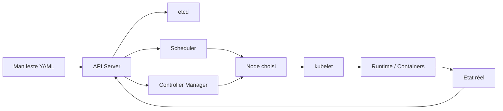

## 1.3 Les 5 capacités clés
- orchestration de workloads,
- réseau et exposition des services,
- persistance et stockage,
- sécurité et gouvernance,
- extensibilité par API et contrôleurs.

## 1.4 Ce qu'un expert N3 doit savoir faire
- lire un YAML et comprendre ses effets,
- identifier la cause racine d'un incident,
- auditer un cluster de bout en bout,
- proposer une cible de remédiation,
- arbitrer entre disponibilité, sécurité, performance et coûts.

---

# 2. Overview

## 2.1 Kubernetes Components
### Control Plane
- **kube-apiserver** : point d'entrée central.
- **etcd** : base clé/valeur, source de vérité.
- **kube-scheduler** : placement des Pods.
- **kube-controller-manager** : contrôleurs de réconciliation.
- **cloud-controller-manager** : intégration cloud.

### Node components
- **kubelet** : agent du nœud.
- **kube-proxy** : règles réseau de service.
- **container runtime** : exécution des conteneurs.

### Schéma
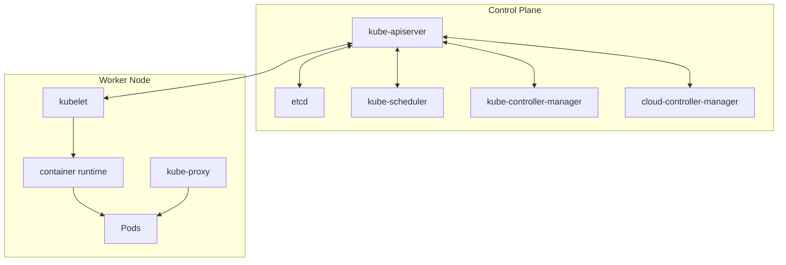

### Angle audit
- API Server hautement disponible ?
- etcd sauvegardé, isolé, chiffré ?
- kubelet durci ?
- runtime standardisé ?

## 2.2 Objects in Kubernetes
Les objets sont la représentation persistante de l'état du cluster.

### Champs structurants
- `apiVersion`
- `kind`
- `metadata`
- `spec`
- `status`

### Exemple
```yaml
apiVersion: apps/v1
kind: Deployment
metadata:
  name: web
spec:
  replicas: 3
```

## 2.3 Kubernetes Object Management
### Trois styles de gestion
- impératif par commande,
- impératif par fichier,
- déclaratif.

### Recommandation
Privilégier le déclaratif versionné dans Git.

## 2.4 Object Names and IDs
- le **name** est unique par type de ressource et namespace,
- l'**UID** est unique globalement,
- les noms stables facilitent observabilité et exploitation.

## 2.5 Labels and Selectors
- les labels classent,
- les selectors ciblent.

### Exemple
```yaml
metadata:
  labels:
    app.kubernetes.io/name: payments
    app.kubernetes.io/component: api
```

### Détails utiles
Les sélecteurs peuvent être :
- **equality-based** : `=` ou `!=`,
- **set-based** : `in`, `notin`, `exists`, `doesNotExist`.

### Angle audit
- labels homogènes ?
- selectors cohérents ?
- services pointant vers les bons pods ?

## 2.6 Namespaces
Les namespaces isolent logiquement les ressources.

### Usage conseillé
- séparation par environnement,
- séparation par produit,
- séparation par équipe ou domaine.

### Attention
Le namespace `default` ne devrait pas accueillir de charges de production importantes.

## 2.7 Annotations
Métadonnées non sélectives.

### Cas fréquents
- directives d'Ingress,
- hooks Argo CD,
- backup/restore,
- informations CI/CD.

### Différence avec les labels
- les **labels** servent à organiser et sélectionner,
- les **annotations** servent à enrichir et décrire.

## 2.8 Field Selectors
Permettent de filtrer des objets selon certains champs.

### Exemple
```bash
kubectl get pods --field-selector=status.phase=Running
```

### Intérêt
Très utile pour filtrer rapidement les objets lors d'un diagnostic ou d'un audit.

## 2.9 Finalizers
Empêchent la suppression d'un objet tant qu'un nettoyage n'a pas eu lieu.

### Cas fréquent
Un volume, un namespace ou une ressource custom peut rester en état `Terminating` à cause d'un finalizer non traité.

### Risque
Des finalizers bloqués peuvent laisser des ressources en état `Terminating` pendant longtemps.

### Diagnostic finalizers bloqués
```bash
# Voir les finalizers d'un objet
kubectl get namespace <ns> -o jsonpath='{.metadata.finalizers}'

# Supprimer un finalizer bloqué (attention : opération dangereuse en prod)
kubectl patch namespace <ns> -p '{"metadata":{"finalizers":[]}}' --type=merge
```

### Anti-pattern
Supprimer des finalizers à la main sans comprendre quel nettoyage devait être effectué. Cela peut laisser des ressources orphelines côté backend (volumes, IPs, entrées DNS...).

## 2.10 Owners and Dependents
Gèrent les relations de propriété entre objets.

### Exemple
Deployment → ReplicaSet → Pods

### Garbage Collection cascade
Quand un owner est supprimé, les dépendants peuvent être supprimés automatiquement selon la `deletionPolicy` :
- **Foreground** : suppression en cascade explicite avant suppression de l'owner,
- **Background** : l'owner est supprimé d'abord, les dépendants le sont en arrière-plan,
- **Orphan** : les dépendants sont orphelins, non supprimés.

## 2.11 Recommended Labels
Jeu de labels standard recommandé :
- `app.kubernetes.io/name`
- `app.kubernetes.io/instance`
- `app.kubernetes.io/version`
- `app.kubernetes.io/component`
- `app.kubernetes.io/part-of`
- `app.kubernetes.io/managed-by`

### Intérêt
Facilite l'exploitation, l'observabilité et l'audit multi-équipes.

## 2.12 Storage Versions
Chaque ressource a une version de stockage interne dans etcd.

### Angle audit
- APIs dépréciées encore utilisées ?
- migrations de versions planifiées ?

### Commande utile
```bash
kubectl api-resources --verbs=list -o wide
kubectl explain <resource>
```

## 2.13 The Kubernetes API
L'API est le cœur du système.

### Principes
- REST,
- objets versionnés,
- validation,
- admission,
- persistance,
- watch.

### Chaîne simplifiée
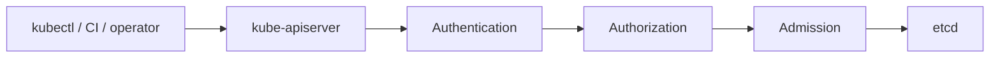

### Ce qu'il faut bien comprendre
- l'API est la seule source de dialogue légitime avec le cluster,
- les contrôleurs observent l'API et réagissent,
- `kubectl` n'agit pas directement sur les nœuds : il passe par l'API Server.

### Groupes et versions d'API
Les ressources sont organisées en groupes :
- **Core group** : `v1` — pods, services, configmaps, secrets...
- **Apps group** : `apps/v1` — deployments, statefulsets, daemonsets...
- **Networking** : `networking.k8s.io/v1` — ingress, networkpolicies...
- **RBAC** : `rbac.authorization.k8s.io/v1`
- **Custom** : groupes définis par les CRDs.

## 2.14 The kubectl command-line tool
2.15 Server-Side Apply (SSA)
`kubectl` est le client standard.

### Commandes structurantes
- `get`
- `describe`
- `apply`
- `diff`
- `logs`
- `exec`
- `top`
- `auth can-i`

### Commandes moins connues mais utiles
```bash
# Voir les différences avant apply
kubectl diff -f manifest.yaml

# Forcer une mise à jour d'un déploiement (rolling restart)
kubectl rollout restart deployment/<name>

# Voir l'historique d'un rollout
kubectl rollout history deployment/<name>

# Revenir à une version précédente
kubectl rollout undo deployment/<name>

# Voir toutes les permissions d'un sujet
kubectl auth can-i --list --as=system:serviceaccount:ns:sa

# Tester la connectivité réseau depuis un pod debug
kubectl run debug --image=busybox -it --rm -- sh
```

### Angle audit
Un expert doit savoir passer de :
- vue globale,
- vue détaillée,
- événements,
- journaux,
- permissions effectives.


## 2.15 Server-Side Apply (SSA)
Server-Side Apply est le mécanisme par lequel **l'API Server** fusionne et gère l'état déclaré d'un objet, au lieu de laisser tout le calcul de fusion au client.

### Pourquoi c'est important
Avec SSA :
- l'API Server suit **qui gère quel champ**,
- les conflits entre outils sont mieux détectés,
- plusieurs acteurs peuvent gérer le même objet de manière plus sûre,
- les workflows GitOps, opérateurs et plateformes deviennent plus prévisibles.

### Idée clé
En mode classique, un client envoie un manifeste et fait une logique de patch plus ou moins côté client.
Avec SSA, le serveur maintient une cartographie de propriété des champs dans `managedFields`.

### `managedFields`
Le champ `metadata.managedFields` contient :
- le manager (ex. `kubectl`, `argocd-controller`, `my-operator`),
- l'opération,
- les champs possédés,
- la version d'API concernée.

### Pourquoi les conflits apparaissent
Si deux acteurs veulent gérer le même champ avec des valeurs différentes, l'API Server peut lever un **conflit**.
C'est sain : cela évite qu'un outil écrase silencieusement le travail d'un autre.

### Exemple de commande
```bash
kubectl apply --server-side -f deployment.yaml
```

### Forcer la prise de possession d'un champ
```bash
kubectl apply --server-side --force-conflicts -f deployment.yaml
```

### Quand utiliser SSA
- GitOps (Argo CD, Flux),
- opérateurs,
- plateformes où plusieurs contrôleurs enrichissent le même objet,
- contextes où l'on veut de la traçabilité fine sur la propriété des champs.

### Quand être prudent
- objets déjà très bricolés avec `patch` impératifs,
- ressources modifiées par plusieurs outils non harmonisés,
- équipes ne sachant pas clairement qui possède quoi.

### Anti-patterns
- mélanger sans gouvernance `kubectl edit`, `kubectl patch`, Helm, opérateurs et GitOps sur le même objet,
- utiliser `--force-conflicts` systématiquement sans comprendre le conflit,
- ignorer `managedFields` en diagnostic.

### Angle audit
- le cluster a-t-il une stratégie claire entre client-side apply, patch et server-side apply ?
- les outils de déploiement se marchent-ils dessus ?
- les conflits de champs sont-ils compris ou subis ?
- les objets critiques ont-ils des `managedFields` cohérents ?

---

# 3. Cluster Architecture

## 3.1 Nodes
Un node exécute les Pods et porte kubelet, kube-proxy et le runtime.

### Points critiques
- version OS,
- patching,
- capacité CPU/RAM/disque,
- durcissement,
- évictions,
- saturation inode/disque.

### États d'un nœud
- **Ready** : nœud opérationnel,
- **NotReady** : nœud en panne ou isolé,
- **SchedulingDisabled** : cordonné (kubectl cordon).

### Conditions surveillées
- `MemoryPressure` : mémoire critique,
- `DiskPressure` : espace disque critique,
- `PIDPressure` : limite de PIDs atteinte,
- `NetworkUnavailable` : réseau absent.

### Commandes diagnostiques
```bash
kubectl get nodes -o wide
kubectl describe node <node>
kubectl top node
kubectl get events --field-selector=involvedObject.kind=Node
```

## 3.2 Communication between Nodes and the Control Plane
L'API Server est le hub central.

### Schéma
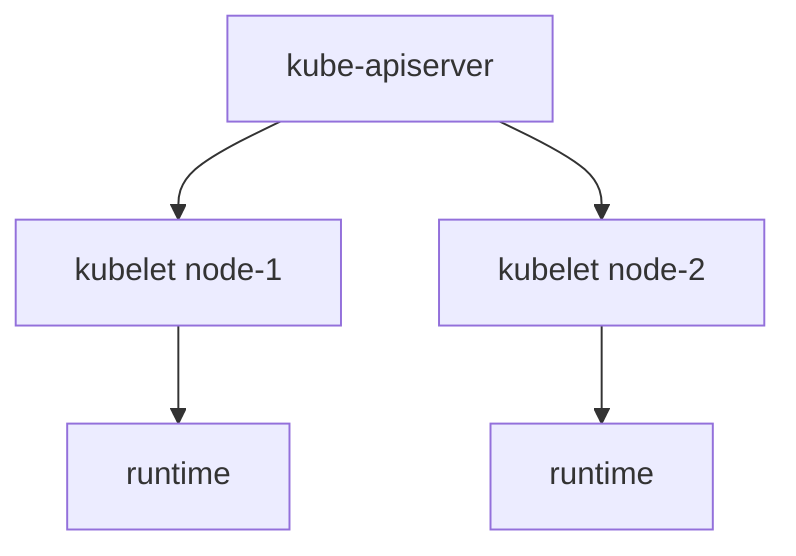

### Deux canaux de communication
- **API Server → kubelet** : logs, exec, port-forward, métriques kubelet,
- **kubelet → API Server** : heartbeats, mises à jour d'état, watch.

### Angle audit
- TLS partout ?
- accès kubelet restreint ?
- ports exposés maîtrisés ?

## 3.3 Controllers
Les contrôleurs comparent état désiré et état réel.

### Exemples
- Deployment controller,
- ReplicaSet controller,
- Node controller,
- Job controller,
- EndpointSlice controller.

### Idée clé
Sans contrôleurs, Kubernetes serait juste une API de stockage de manifests.

### Pattern de réconciliation
```
observe → compare → agit → observe ...
```

Chaque contrôleur :
1. écoute les changements d'objets (watch),
2. compare l'état actuel à l'état désiré,
3. effectue des actions correctives,
4. met à jour le status de l'objet.

## 3.4 Leases
Utilisés pour les heartbeats et certaines élections de leader.

### Rôle concret
- chaque kubelet renouvelle un objet Lease dans le namespace `kube-node-lease`,
- l'API Server surveille ces renouvellements pour détecter les nœuds morts,
- beaucoup moins coûteux que de mettre à jour l'objet Node complet.

### Élection de leader
Les composants redondants du control plane (scheduler, controller-manager) utilisent des Leases pour s'assurer qu'un seul acteur est actif à la fois.

## 3.5 Cloud Controller Manager
Sort la logique cloud hors du cœur Kubernetes.

### Fonctions
- load balancers,
- routes,
- volumes,
- informations de nœuds.

### Intérêt
Permet de garder Kubernetes plus portable entre environnements.

### Implémentations
Chaque cloud provider fournit son implémentation : AWS (cloud-controller-manager pour EKS), GCP (pour GKE), Azure (pour AKS), etc.

## 3.6 About cgroup v2
Standard moderne de gestion des ressources Linux.

### Intérêt
Meilleure cohérence de la gestion CPU/mémoire/IO selon les distributions récentes.

### Ce que cela change concrètement
- unified hierarchy vs v1 (multiple hierarchies),
- meilleure gestion de la mémoire pour les conteneurs,
- meilleures garanties pour les ressources swap,
- requis par certaines fonctionnalités récentes Kubernetes.

### Vérifier si cgroup v2 est actif
```bash
stat -fc %T /sys/fs/cgroup/
# Si le résultat est "cgroup2fs", c'est v2
```

## 3.7 Kubernetes Self-Healing
- restart de conteneurs,
- remplacement de Pods,
- reprovisionnement des réplicas,
- réassignation après panne de nœud.

### Limite à retenir
Kubernetes répare l'infrastructure d'exécution, pas la logique métier de ton application.

### Comportements selon les cas
- **conteneur crashe** → kubelet le redémarre selon `restartPolicy`,
- **Pod disapparaît** → le contrôleur (Deployment, StatefulSet...) en crée un nouveau,
- **nœud tombe** → après un délai (`node.kubernetes.io/not-ready`), les Pods sont réaffectés ailleurs,
- **réplica manquant** → le ReplicaSet Controller crée un Pod de remplacement.

## 3.8 Garbage Collection
Suppression des objets devenus inutiles.

### Ce qui est collecté
- ReplicaSets anciens d'un Deployment (selon `revisionHistoryLimit`),
- Pods complétés des Jobs,
- images de conteneurs non utilisées (via le kubelet),
- Pods orphelins.

### Risque audit
Objets orphelins, volumes non libérés, charge de contrôle inutile.

### Paramètre important
```yaml
spec:
  revisionHistoryLimit: 3  # Garder seulement 3 anciens ReplicaSets
```

## 3.9 Mixed Version Proxy
Sujet lié aux compatibilités de version des composants.

### Bonne pratique
Maîtriser la matrice de compatibilité pendant les upgrades.

### Version skew policy Kubernetes
- kube-apiserver : le composant le plus récent, upgradé en premier,
- kube-controller-manager, kube-scheduler : peuvent être N-1 par rapport à l'API Server,
- kubelet : peut être N-2 par rapport à l'API Server,
- kubectl : N+1 ou N-1 par rapport à l'API Server.

### Angle audit architecture
- control plane homogène ?
- version skew conforme ?
- cloud integrations bien comprises ?
- kubelet et runtime alignés avec la version cluster ?

---

# 4. Containers

## 4.1 Images
Les images doivent être :
- immuables,
- scannées,
- signées si possible,
- minimales,
- référencées idéalement par digest.

### Anti-patterns
- `latest`,
- images root inutiles,
- images trop larges,
- provenance non maîtrisée.

### Référencer par digest
```yaml
# À éviter
image: nginx:latest

# Mieux mais mutable
image: nginx:1.25.3

# Idéal en production — immutable et traçable
image: nginx@sha256:abc123...
```

### Stratégie de base images
- utiliser des images officielles ou vérifiées,
- préférer `distroless` ou `alpine` pour réduire la surface d'attaque,
- scanner systématiquement avant push (Trivy, Grype, Snyk...),
- ne jamais rebuilder une image sans changelog.

## 4.2 Container Environment
Variables d'environnement, DNS, fichiers montés, downward API.

### Idée clé
Le conteneur ne vit jamais seul : il hérite d'un contexte d'exécution Kubernetes.

### Ce que le conteneur reçoit automatiquement
- les variables d'environnement définies dans la spec,
- des variables injectées automatiquement (downward API),
- le fichier `/etc/resolv.conf` configuré par Kubernetes (pointe vers CoreDNS),
- le token ServiceAccount monté dans `/var/run/secrets/kubernetes.io/serviceaccount/`.

### Downward API — exemples utiles
```yaml
env:
  - name: MY_POD_NAME
    valueFrom:
      fieldRef:
        fieldPath: metadata.name
  - name: MY_POD_NAMESPACE
    valueFrom:
      fieldRef:
        fieldPath: metadata.namespace
  - name: MY_NODE_NAME
    valueFrom:
      fieldRef:
        fieldPath: spec.nodeName
  - name: MY_CPU_REQUEST
    valueFrom:
      resourceFieldRef:
        resource: requests.cpu
```

## 4.3 RuntimeClass
Permet de sélectionner un runtime spécifique.

### Cas d'usage
- isolation renforcée,
- sandboxes,
- besoins particuliers d'exécution.

### Exemples de runtimes alternatifs
- **gVisor (runsc)** : sandbox application-level kernel,
- **Kata Containers** : VM légères pour isolation forte,
- **containerd** + `runc` : standard,
- **CRI-O** + `runc` : alternative légère.

### Exemple YAML
```yaml
apiVersion: node.k8s.io/v1
kind: RuntimeClass
metadata:
  name: kata-containers
handler: kata
---
# Dans le Pod
spec:
  runtimeClassName: kata-containers
```

## 4.4 Container Lifecycle Hooks
- `postStart`
- `preStop`

### Risque
Mauvaise gestion de l'arrêt gracieux, coupure de trafic avant terminaison propre, corruption possible pour certaines applications.

### Séquence d'arrêt d'un Pod (CRITIQUE à comprendre)
```
1. Pod entre en Terminating
2. Kubernetes retire le Pod des Endpoints du Service
3. preStop hook exécuté (si défini)
4. SIGTERM envoyé aux conteneurs
5. Grace period (terminationGracePeriodSeconds, défaut 30s)
6. SIGKILL si le conteneur n'est pas terminé
```

### Bonne pratique preStop
```yaml
lifecycle:
  preStop:
    exec:
      command: ["sleep", "5"]  # Laisser le temps aux requêtes en cours de finir
```

### Pourquoi le sleep dans preStop ?
Il y a une race condition : le Pod est retiré des Endpoints en parallèle du SIGTERM. Un petit délai dans preStop laisse au load balancer le temps de prendre en compte la mise à jour.

## 4.5 Container Runtime Interface (CRI)
Interface standard entre kubelet et runtime.

### Runtimes courants
- containerd,
- CRI-O.

### Ce que fait réellement le runtime
- télécharge les images,
- crée les namespaces Linux (pid, net, mnt, uts, ipc),
- gère les cgroups,
- démarre et surveille les processus conteneurs.

### Angle audit containers
- images référencées par tag mutable ?
- runtime homogène dans le cluster ?
- hooks maîtrisés ?
- security context cohérent avec le runtime ?

---

# 5. Workloads (ULTRA DÉTAILLÉ)

## 5.1 Vision globale
Les **workloads** représentent la manière dont les applications sont exécutées et maintenues dans Kubernetes.

Idée clé : Kubernetes ne "lance" pas une app une fois, il **maintient un état désiré** via des contrôleurs.

```mermaid
flowchart LR
Desired[État désiré (YAML)] --> Controller[Controller]
Controller --> Actual[État réel (Pods)]
Actual --> Loop[Boucle de réconciliation]
Loop --> Controller
```

---

## 5.2 Pod — unité fondamentale
Un **Pod** est la plus petite unité exécutable.

### Contenu
- 1..N conteneurs
- IP unique
- volumes partagés
- cycle de vie commun

### Points clés
- éphémère
- non autoscalé seul
- non redéployé automatiquement sans contrôleur

### Exemple
```yaml
apiVersion: v1
kind: Pod
metadata:
  name: app
spec:
  containers:
    - name: app
      image: nginx:1.25.3
      resources:
        requests:
          cpu: 100m
          memory: 128Mi
        limits:
          cpu: 200m
          memory: 256Mi
```

### Le réseau d'un Pod
Tous les conteneurs d'un Pod partagent :
- la même adresse IP,
- les mêmes ports réseau,
- le même namespace réseau.

Ils communiquent entre eux via `localhost`.

---

## 5.3 Pod Lifecycle
Phases :
- **Pending** : Pod créé mais pas encore schedulé ou images non téléchargées,
- **Running** : au moins un conteneur est en cours d'exécution,
- **Succeeded** : tous les conteneurs se sont terminés avec succès (code 0),
- **Failed** : au moins un conteneur s'est terminé avec un code non nul,
- **Unknown** : état non déterminable (souvent nœud inaccessible).

### Conditions
- `PodScheduled` : Pod assigné à un nœud,
- `Initialized` : init containers terminés avec succès,
- `ContainersReady` : tous les conteneurs sont prêts,
- `Ready` : le Pod peut recevoir du trafic.

### Différence phase vs condition
- la **phase** est l'état global,
- les **conditions** donnent plus de détail sur chaque aspect.

### restartPolicy
- `Always` (défaut) : redémarre toujours (Deployment),
- `OnFailure` : redémarre si échec (Job),
- `Never` : ne redémarre jamais.

### Diagnostic
```bash
kubectl describe pod <pod>
kubectl get pod <pod> -o jsonpath='{.status.phase}'
kubectl get pod <pod> -o jsonpath='{.status.conditions}'
```

---

## 5.4 Init Containers
Exécutés **avant** les conteneurs applicatifs.

### Cas d'usage
- migrations DB
- attente dépendance
- préparation config

### Caractéristiques importantes
- s'exécutent séquentiellement,
- chacun doit réussir avant le suivant,
- les conteneurs applicatifs ne démarrent qu'une fois tous les init containers terminés,
- si un init container échoue, le Pod est redémarré selon `restartPolicy`.

### Exemple avec attente de dépendance
```yaml
initContainers:
  - name: wait-for-db
    image: busybox
    command: ['sh', '-c',
      'until nc -z postgres-svc 5432; do echo waiting; sleep 2; done']
```

### Différence avec sidecar containers
Les init containers se terminent avant que l'app ne démarre. Les sidecars tournent en parallèle.

---

## 5.5 Sidecar Containers
Conteneurs auxiliaires dans le même Pod.

### Exemples
- proxy (Envoy dans un service mesh)
- collecte de logs
- agent de sécurité
- rotation automatique de secrets

### Sidecar natif (Kubernetes 1.29+)
Kubernetes 1.29 a introduit les sidecars natifs via `initContainers` avec `restartPolicy: Always`. Cela garantit que le sidecar démarre avant les conteneurs applicatifs et reste actif tout au long de la vie du Pod.

```yaml
initContainers:
  - name: log-collector
    image: fluentbit:latest
    restartPolicy: Always  # Sidecar natif
```

---

## 5.6 Ephemeral Containers
Utilisés pour le debug d'un Pod en cours d'exécution.

```bash
kubectl debug -it <pod> --image=busybox --target=<container>
```

### Caractéristiques
- ne peuvent pas être redémarrés,
- ne peuvent pas avoir de ports déclarés,
- ne persistent pas dans la spec du Pod,
- très utiles pour débugger des images distroless ou sans shell.

### Cas d'usage typique
Image applicative sans shell → on attache un container éphémère avec des outils de debug.

---

## 5.7 Probes (CRITIQUE)

### Liveness
Redémarre le conteneur si la probe échoue.

**Usage** : détecter les deadlocks ou états corrompus où l'application est lancée mais non fonctionnelle.

### Readiness
Retire le Pod des Endpoints du Service si la probe échoue.

**Usage** : contrôler quand le Pod peut recevoir du trafic. Essentiel pendant les démarrages et les pics de charge.

### Startup
Désactive liveness et readiness jusqu'à sa réussite.

**Usage** : applications à démarrage long pour éviter que liveness les tue prématurément.

### Exemple complet
```yaml
startupProbe:
  httpGet:
    path: /startup
    port: 8080
  failureThreshold: 30
  periodSeconds: 10   # 30 * 10s = 5 minutes max pour démarrer

livenessProbe:
  httpGet:
    path: /health
    port: 8080
  initialDelaySeconds: 0  # Startup probe gère déjà le délai
  periodSeconds: 10
  failureThreshold: 3

readinessProbe:
  httpGet:
    path: /ready
    port: 8080
  periodSeconds: 5
  failureThreshold: 3
```

### Mécanismes disponibles
- `httpGet` : requête HTTP, succès si 200-399,
- `tcpSocket` : connexion TCP,
- `exec` : commande, succès si code de retour 0,
- `grpc` : requête gRPC Health Check.

### Erreurs fréquentes
- liveness trop agressive (failureThreshold trop bas) → boucle de redémarrage,
- absence de readiness → trafic envoyé à un Pod pas prêt,
- même endpoint pour liveness et readiness → mauvais comportement sous charge,
- probe sur un endpoint qui dépend d'une dépendance externe → cascade de redémarrages.

---

## 5.8 Resources (requests / limits)

### Définitions
- `requests` : ce dont le Pod a besoin pour être schedulé,
- `limits` : le maximum que le Pod peut consommer.

### Impact requests
- le scheduler utilise les `requests` pour décider sur quel nœud placer le Pod,
- un nœud sans assez de ressources disponibles pour satisfaire les `requests` est filtré.

### Impact limits
- **CPU** : throttling (jamais tué pour CPU),
- **Mémoire** : OOMKilled si la limite est dépassée.

### Classes QoS
- **Guaranteed** : `requests == limits` pour CPU et mémoire → priorité maximale d'éviction,
- **Burstable** : `requests < limits` → priorité intermédiaire,
- **BestEffort** : aucun `requests` ni `limits` → première cible d'éviction.

### Exemple
```yaml
resources:
  requests:
    cpu: 100m       # 0.1 vCPU garanti pour scheduling
    memory: 128Mi   # 128 MiB garanti pour scheduling
  limits:
    cpu: 500m       # 0.5 vCPU max avant throttling
    memory: 512Mi   # 512 MiB max avant OOMKill
```

### Unités
- CPU : `m` = millicores (1000m = 1 vCPU),
- Mémoire : `Mi` (mebibytes), `Gi`, `Ki`...

### Bonne pratique
Toujours définir au minimum les `requests`. Définir les `limits` mémoire. Ne pas toujours limiter le CPU si cela provoque du throttling inutile sur les applications Java ou Go.

---

## 5.9 Deployment
Pour apps stateless.

### Capacités
- rolling update
- rollback
- scaling horizontal

```mermaid
flowchart LR
Deployment --> ReplicaSet2[ReplicaSet v2]
Deployment --> ReplicaSet1[ReplicaSet v1 (conservé)]
ReplicaSet2 --> Pod1[Pod v2]
ReplicaSet2 --> Pod2[Pod v2]
ReplicaSet2 --> Pod3[Pod v2]
```

### Stratégies de mise à jour
**RollingUpdate** (défaut) :
```yaml
strategy:
  type: RollingUpdate
  rollingUpdate:
    maxUnavailable: 1   # Pods inaccessibles max pendant la mise à jour
    maxSurge: 1         # Pods supplémentaires max pendant la mise à jour
```

**Recreate** : supprime tous les anciens Pods avant de créer les nouveaux (temps d'arrêt mais garanti une seule version active).

### Commandes utiles
```bash
kubectl rollout status deployment/<name>
kubectl rollout history deployment/<name>
kubectl rollout undo deployment/<name>
kubectl rollout undo deployment/<name> --to-revision=2
kubectl scale deployment/<name> --replicas=5
```

---

## 5.10 ReplicaSet
Maintient N Pods identiques.

### À retenir
- le ReplicaSet est géré par le Deployment, pas directement par l'utilisateur,
- ne jamais modifier un ReplicaSet manuellement si créé par un Deployment,
- chaque mise à jour du Deployment crée un nouveau ReplicaSet.

---

## 5.11 StatefulSet
Pour apps stateful.

### Garanties
- identité stable (nom = `<statefulset>-<ordinal>`, ex: `mysql-0`, `mysql-1`),
- stockage stable via `volumeClaimTemplates` (chaque réplica a son propre PVC),
- ordre de démarrage (0 → 1 → 2...),
- ordre d'arrêt inversé (2 → 1 → 0),
- DNS stable via headless service.

### Exemple
```yaml
apiVersion: apps/v1
kind: StatefulSet
metadata:
  name: postgres
spec:
  serviceName: postgres-headless
  replicas: 3
  selector:
    matchLabels:
      app: postgres
  template:
    metadata:
      labels:
        app: postgres
    spec:
      containers:
        - name: postgres
          image: postgres:15
  volumeClaimTemplates:
    - metadata:
        name: data
      spec:
        accessModes: ["ReadWriteOnce"]
        resources:
          requests:
            storage: 10Gi
```

### Ce que StatefulSet ne fait PAS
- ne gère pas la réplication des données applicatives,
- ne gère pas le quorum,
- ne configure pas l'application pour former un cluster.

---

## 5.12 DaemonSet
1 Pod par node (ou par sous-ensemble filtré).

### Cas
- agent de logs (Fluentd, Fluentbit),
- agent de monitoring (Node Exporter, Datadog Agent),
- agent de sécurité (Falco),
- plugin réseau CNI.

### Filtrage sur certains nœuds
```yaml
spec:
  template:
    spec:
      nodeSelector:
        disktype: ssd
```

### Mise à jour
- `RollingUpdate` : mise à jour nœud par nœud,
- `OnDelete` : mise à jour manuelle Pod par Pod.

---

## 5.13 Jobs
Tâches finies.

### Caractéristiques
- un Job est "complet" quand un nombre défini de Pods ont réussi,
- les Pods complétés sont conservés pour consultation des logs.

### Paramètres importants
```yaml
spec:
  completions: 3       # Nombre de succès requis
  parallelism: 2       # Nombre de Pods en parallèle
  backoffLimit: 4      # Nombre de tentatives avant échec du Job
  activeDeadlineSeconds: 600  # Durée max du Job
```

### Nettoyage automatique
```yaml
ttlSecondsAfterFinished: 300  # Supprime le Job 5 min après sa fin
```

---

## 5.14 CronJobs
Tâches planifiées.

### Exemple
```yaml
apiVersion: batch/v1
kind: CronJob
metadata:
  name: cleanup
spec:
  schedule: "0 2 * * *"   # Tous les jours à 2h du matin
  concurrencyPolicy: Forbid  # Ne pas lancer si le précédent tourne encore
  successfulJobsHistoryLimit: 3
  failedJobsHistoryLimit: 1
  jobTemplate:
    spec:
      template:
        spec:
          containers:
            - name: cleanup
              image: myapp:cleaner
          restartPolicy: OnFailure
```

### concurrencyPolicy
- `Allow` : plusieurs instances peuvent tourner en parallèle,
- `Forbid` : ne pas lancer si le précédent est encore en cours,
- `Replace` : remplacer le Job en cours par le nouveau.

---

## 5.15 Autoscaling

### HPA (Horizontal Pod Autoscaler)
Ajuste le nombre de réplicas en fonction de métriques.

```yaml
apiVersion: autoscaling/v2
kind: HorizontalPodAutoscaler
metadata:
  name: app-hpa
spec:
  scaleTargetRef:
    apiVersion: apps/v1
    kind: Deployment
    name: app
  minReplicas: 2
  maxReplicas: 20
  metrics:
    - type: Resource
      resource:
        name: cpu
        target:
          type: Utilization
          averageUtilization: 70
```

**Prérequis** : `requests` CPU/mémoire définis, metrics-server déployé.

### VPA (Vertical Pod Autoscaler)
Ajuste les `requests` et `limits` CPU/mémoire selon l'utilisation réelle.

**Modes** :
- `Off` : recommandations uniquement, sans action,
- `Initial` : applique au démarrage du Pod,
- `Auto` : peut recréer les Pods pour appliquer les nouvelles valeurs.

**Limite** : incompatible avec HPA sur les mêmes métriques. Ne pas utiliser les deux simultanément sur CPU/mémoire.

### KEDA (Kubernetes Event-Driven Autoscaling)
Extension populaire permettant de scaler selon des métriques externes : longueur d'une queue Kafka, messages SQS, requêtes HTTP, métriques Prometheus...

### Cluster Autoscaler
Ajoute ou supprime des nœuds selon la demande.

- **scale-up** : Pods en Pending à cause de ressources insuffisantes → ajout de nœuds,
- **scale-down** : nœuds sous-utilisés depuis un délai → drain et suppression.

**Point important** : interagit avec le fournisseur cloud (AWS ASG, GCP MIG...).

---

## 5.16 Scheduling interactions
Les workloads influencent le scheduler via :
- requests/limits,
- affinity,
- taints/tolerations,
- topology spread constraints.

---

## 5.17 Disruptions

### Volontaires
- rolling update,
- drain de nœud pour maintenance,
- suppression manuelle.

### Involontaires
- crash de conteneur,
- panne de nœud,
- éviction par pression ressource.

### Protection : PodDisruptionBudget (PDB)
```yaml
apiVersion: policy/v1
kind: PodDisruptionBudget
metadata:
  name: app-pdb
spec:
  minAvailable: 2        # Au minimum 2 Pods doivent rester disponibles
  # OU
  # maxUnavailable: 1    # Au maximum 1 Pod peut être indisponible
  selector:
    matchLabels:
      app: webapp
```

**Effet** : lors d'un `kubectl drain`, Kubernetes respectera le PDB et attendra qu'un nouveau Pod soit prêt avant d'en retirer un autre.

---

## 5.18 Anti-patterns
- utiliser Pod seul sans contrôleur,
- pas de probes (liveness/readiness),
- pas de limits mémoire,
- StatefulSet mal compris (confondu avec un outil de clustering),
- image `latest` en production,
- pas de PDB pour les applications critiques,
- HPA sans définition de `requests`.

---

## 5.19 Diagnostic Workloads

```bash
# Vue générale
kubectl get pods -n <ns> -o wide

# Détail d'un Pod
kubectl describe pod <pod> -n <ns>

# Logs
kubectl logs <pod> -c <container> --previous   # Logs du container précédent (après crash)
kubectl logs <pod> -f --tail=100               # Suivre les logs en live

# Statut d'un rollout
kubectl rollout status deployment/<name>

# Events récents
kubectl get events -n <ns> --sort-by='.lastTimestamp'
```

---

## 5.20 Checklist audit Workloads

- bon type de contrôleur (Deployment vs StatefulSet vs DaemonSet) ?
- probes liveness et readiness définies ?
- requests et limits définies ?
- PDB en place pour les apps critiques ?
- résilience HA assurée (minReplicas >= 2) ?
- politique de rollout configurée ?
- revisionHistoryLimit adapté ?
- CronJobs avec concurrencyPolicy défini ?
- autoscaling cohérent avec les ressources ?

---

## 5.21 Résumé
```text
Pod         = unité fondamentale d'exécution
Deployment  = stateless avec rolling update et rollback
StatefulSet = identité stable + stockage stable
DaemonSet   = 1 Pod par nœud
Job         = tâche batch finie
CronJob     = tâche planifiée
HPA         = scaling horizontal automatique
VPA         = sizing automatique des ressources
PDB         = protection contre les disruptions
```

---
# 6. Services, Load Balancing and Networking (ULTRA DÉTAILLÉ)

## 6.1 Vision globale du réseau Kubernetes
Le réseau Kubernetes doit répondre à 4 besoins fondamentaux :
- permettre la communication **Pod ↔ Pod**,
- exposer des groupes de Pods via des **Services**,
- fournir une **résolution DNS** stable,
- publier certaines applications vers l'extérieur via **Ingress** ou **Gateway API**.

### Modèle mental simple
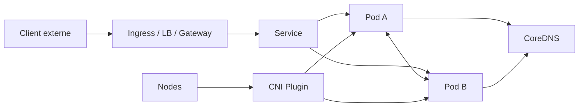

### Idée clé
Le Pod est l'unité réseau de base.  
Chaque Pod a sa propre IP.  
Le Service apporte une adresse stable.  
Le DNS permet de retrouver cette adresse.  
Le CNI rend tout cela possible au niveau réseau.

---

## 6.2 Le modèle réseau Kubernetes

### Règles de base
Le modèle réseau Kubernetes suppose que :
- chaque Pod possède une IP unique,
- les Pods peuvent communiquer entre eux sans NAT intermédiaire côté cluster,
- les nœuds peuvent joindre les Pods,
- les Pods voient leur propre IP comme leur IP réelle.

### Conséquence pratique
Le réseau Kubernetes n'est pas juste un "pont Docker".  
C'est une couche réseau distribuée qui doit fonctionner **à l'échelle du cluster**.

### Angle audit
- plage CIDR Pods cohérente ?
- routage inter-nœuds stable ?
- MTU cohérente ?
- NAT / masquerade maîtrisés ?

---

## 6.3 Pods et IPs

### Ce qu'il faut retenir
- chaque Pod reçoit une IP du CIDR Pod,
- cette IP est éphémère : elle change à chaque recréation du Pod,
- les IPs Pod ne sont pas routables directement hors cluster dans la plupart des architectures.

### Conséquence architecturale
On ne doit **jamais** dépendre directement de l'IP d'un Pod pour construire une application résiliente.

### Bonne pratique
Utiliser toujours un **Service** comme point d'accès stable.

---

## 6.4 Service : rôle et principe
Le **Service** est un objet qui offre :
- une adresse stable (ClusterIP),
- un nom stable (DNS),
- une abstraction réseau devant un ensemble de Pods.

### Schéma
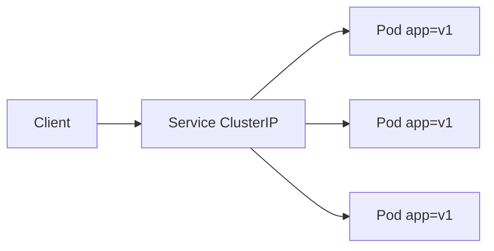

### Ce que fait le Service
- sélectionne des Pods via des labels,
- publie un endpoint stable,
- répartit le trafic vers les Pods sélectionnés.

### Angle audit
- selectors exacts ?
- service pointe-t-il vers les bons Pods ?
- endpoints présents ?
- ports cohérents ?

---

## 6.5 Types de Services

### 6.5.1 ClusterIP
Type par défaut. Accessible uniquement depuis l'intérieur du cluster.

- sert à exposer un backend interne,
- utilisé pour microservices, BDD internes, APIs backend.

### 6.5.2 NodePort
Exposition sur un port fixe (30000-32767) de chaque nœud.

- utile pour tests ou environnements bare-metal simples,
- souvent évité en production si Ingress/LB existent,
- chaque nœud doit être accessible si on utilise ce type.

### 6.5.3 LoadBalancer
Crée un point d'entrée externe via l'intégration cloud ou un contrôleur spécifique (MetalLB, etc.).

- chaque Service LoadBalancer consomme une IP externe,
- peut être coûteux si utilisé massivement (préférer Ingress),
- idéal pour services TCP/UDP non HTTP.

### 6.5.4 ExternalName
Service logique pointant vers un nom DNS externe.

```yaml
spec:
  type: ExternalName
  externalName: database.company.internal
```

Utile pour référencer proprement une dépendance hors cluster sans hardcoder des URLs.

### Résumé rapide
```text
ClusterIP    = interne au cluster
NodePort     = externe via port du nœud
LoadBalancer = externe via IP dédiée
ExternalName = alias DNS externe
```

---

## 6.6 Sélection des Pods par le Service

```yaml
apiVersion: v1
kind: Service
metadata:
  name: payments-api
spec:
  selector:
    app: payments
    tier: api
  ports:
    - port: 80
      targetPort: 8080
```

### Risque classique
Le Service existe, mais aucun Pod ne correspond au selector.

### Diagnostic
```bash
kubectl get svc
kubectl get endpoints
kubectl get endpointslices
kubectl get pods --show-labels
```

---

## 6.7 Ports dans un Service

### Distinctions importantes
- `port` : port exposé par le Service (ce que les clients appellent),
- `targetPort` : port du conteneur cible,
- `nodePort` : port publié sur le nœud (NodePort uniquement).

### Piège fréquent
Confondre le `containerPort` déclaré dans le Pod (purement informatif) avec le `targetPort` du Service (fonctionnel).

---

## 6.8 kube-proxy et implémentation du Service
Le Service n'est pas un vrai processus réseau dédié.  
Il est implémenté sur les nœuds par **kube-proxy** via :
- iptables (mode classique),
- IPVS (plus scalable),
- ou mécanismes eBPF alternatifs (Cilium sans kube-proxy).

### Rôle de kube-proxy
- surveiller les Services et Endpoints/EndpointSlices,
- programmer les règles de trafic,
- assurer la distribution vers les bons Pods.

### Angle audit
- kube-proxy en bonne santé ?
- mode iptables ou IPVS maîtrisé ?
- explosion de règles iptables sur grand cluster ?
- alternatives eBPF en place ?

---

## 6.9 Endpoint et EndpointSlice

### Ancien objet
`Endpoints` : un seul objet par Service, liste toutes les IPs backend. Problème de scalabilité au-delà de quelques centaines de Pods.

### Objet moderne
`EndpointSlice` : liste découpée en tranches (par défaut 100 endpoints/slice), meilleure scalabilité et distribution de la mise à jour.

### Diagnostic
```bash
kubectl get endpoints
kubectl get endpointslices.discovery.k8s.io
```

---

## 6.10 Headless Service

```yaml
spec:
  clusterIP: None
  selector:
    app: postgres
```

### Rôle
Il ne fournit pas de VIP unique.  
Il expose directement la résolution DNS des Pods du StatefulSet.

### DNS généré
`<pod-name>.<service-name>.<namespace>.svc.cluster.local`  
Exemple : `postgres-0.postgres-headless.default.svc.cluster.local`

### Cas d'usage
- StatefulSet,
- bases de données distribuées,
- découverte fine des membres d'un cluster applicatif.

---

## 6.11 DNS Kubernetes
Le DNS interne est généralement assuré par **CoreDNS**.

### Forme standard d'un nom
```text
<service>.<namespace>.svc.cluster.local
```

### Raccourcis DNS
Dans le même namespace, souvent le nom court suffit : `payments-api`.  
Depuis un namespace différent : `payments-api.payments.svc.cluster.local`.

### Configuration DNS personnalisée
```yaml
spec:
  dnsPolicy: ClusterFirst  # Défaut : résoud d'abord via CoreDNS
  dnsConfig:
    options:
      - name: ndots
        value: "2"
```

---

## 6.12 Comment fonctionne la résolution DNS

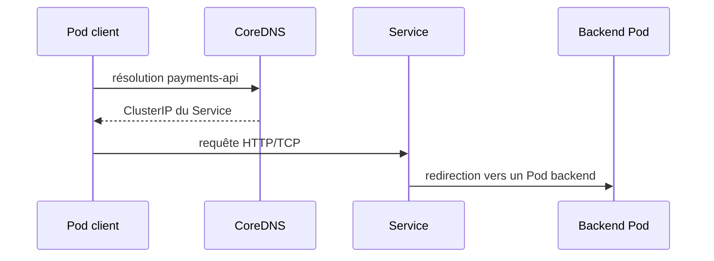

---

## 6.13 DNS des Pods
Dans certains cas, les Pods peuvent aussi être résolus par DNS, surtout avec :
- StatefulSet + headless service,
- identités réseau stables.

---

## 6.14 Problèmes DNS courants

### Symptômes
- nom de service non résolu,
- résolution lente,
- service joignable par IP mais pas par nom.

### Causes fréquentes
- CoreDNS en panne ou surchargé,
- NetworkPolicy bloquant le port 53 UDP/TCP vers CoreDNS,
- `dnsPolicy` mal configuré,
- namespace incorrect dans le nom de service.

### Diagnostic
```bash
kubectl get pods -n kube-system -l k8s-app=kube-dns
kubectl logs -n kube-system deployment/coredns
kubectl exec -it <pod> -- nslookup payments-api
kubectl exec -it <pod> -- cat /etc/resolv.conf
kubectl exec -it <pod> -- nslookup payments-api.default.svc.cluster.local
```

---

## 6.15 Ingress : rôle
L'**Ingress** permet d'exposer des services HTTP/HTTPS à l'extérieur avec :
- routage par host,
- routage par path,
- terminaison TLS.

### Idée clé
Ingress n'est qu'une **ressource déclarative**.  
Le comportement réel dépend d'un **Ingress Controller**.

---

## 6.16 Ingress Controller
Sans contrôleur, un Ingress ne sert à rien.

### Exemples
- NGINX Ingress Controller,
- Traefik,
- HAProxy Ingress,
- Contour,
- contrôleurs cloud natifs (ALB AWS, Application Gateway Azure...).

### Ce que fait le contrôleur
- observe les objets Ingress,
- génère la configuration réseau réelle,
- gère le TLS,
- applique le routage.

---

## 6.17 Règles Ingress

```yaml
apiVersion: networking.k8s.io/v1
kind: Ingress
metadata:
  name: app-ingress
  annotations:
    nginx.ingress.kubernetes.io/rewrite-target: /
spec:
  ingressClassName: nginx
  tls:
    - hosts:
        - app.example.com
      secretName: app-tls-secret
  rules:
    - host: app.example.com
      http:
        paths:
          - path: /api
            pathType: Prefix
            backend:
              service:
                name: api-service
                port:
                  number: 80
          - path: /
            pathType: Prefix
            backend:
              service:
                name: frontend-service
                port:
                  number: 80
```

---

## 6.18 TLS avec Ingress

### Prérequis
- Créer un Secret de type `kubernetes.io/tls` contenant `tls.crt` et `tls.key`,
- référencer ce Secret dans la spec Ingress.

### Automatisation avec cert-manager
cert-manager peut générer et renouveler automatiquement les certificats (Let's Encrypt ou CA interne).

### Angle audit
- certificats valides et non expirés ?
- renouvellement automatisé ?
- TLS forcé (redirection HTTP → HTTPS) ?
- hôtes effectivement protégés ?

---

## 6.19 Annotations Ingress
Beaucoup de contrôleurs utilisent des annotations pour :
- rewrite,
- timeouts,
- taille max body,
- authentification,
- redirections,
- rate limiting,
- CORS.

### Risque
Une annotation mal orthographiée est silencieusement ignorée. Toujours vérifier avec `kubectl describe ingress`.

---

## 6.20 IngressClass
Permet d'indiquer quel contrôleur doit gérer l'Ingress.

```yaml
spec:
  ingressClassName: nginx
```

### Risque
L'Ingress est correct mais ignoré car il n'est rattaché à aucune classe effective, ou la classe par défaut n'est pas celle attendue.

---

## 6.21 Gateway API
Évolution moderne d'Ingress.

### Objets principaux
- **GatewayClass** : définit le type de gateway (équivalent IngressClass),
- **Gateway** : point d'entrée réseau (géré par l'infra),
- **HTTPRoute** : règles de routage HTTP (géré par les devs),
- **TCPRoute**, **TLSRoute**, **GRPCRoute**...

### Avantages vs Ingress
- meilleure séparation des responsabilités (infra vs dev),
- plus expressive,
- meilleur support multi-protocoles,
- portabilité entre contrôleurs.

### Vision architecte
Ingress reste très courant, mais Gateway API devient le standard pour les architectures avancées.

---

## 6.22 CNI : rôle fondamental
Le **CNI (Container Network Interface)** est la couche qui permet de connecter les Pods au réseau.

### Il gère notamment
- attribution des IPs Pods,
- interfaces réseau virtuelles,
- routage inter-nœuds,
- parfois NetworkPolicy,
- parfois chiffrement,
- parfois observabilité réseau avancée.

### Exemples de CNI
- **Calico** : BGP, NetworkPolicy, performances élevées,
- **Cilium** : eBPF, observabilité L7, sans kube-proxy,
- **Flannel** : simple, VXLAN, pas de NetworkPolicy native,
- **Weave Net** : chiffrement intégré, simplifié,
- plugins cloud natifs (Amazon VPC CNI, Azure CNI, GKE Dataplane V2).

---

## 6.23 Ce que fait réellement le CNI

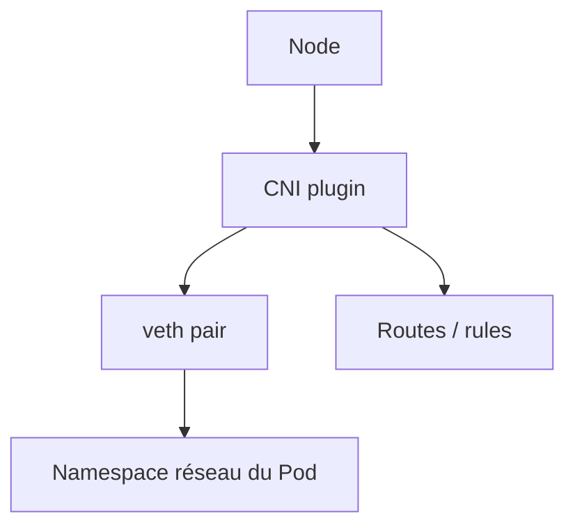

---

## 6.24 CNI et NetworkPolicy

### Point capital
Créer une `NetworkPolicy` ne garantit pas sa prise en compte si le CNI ne l'implémente pas.

**Flannel** par exemple ne supporte pas les NetworkPolicies nativement (nécessite Calico en mode policy-only).

### Angle audit
- CNI supporte-t-il les policies ?
- policy engine activé et fonctionnel ?
- comportement testé avec des tests de connectivité ?

---

## 6.25 CNI et chiffrement
Certains CNIs permettent le chiffrement inter-nœuds ou inter-pods.

### Exemples
- **Cilium** : WireGuard intégré,
- **Calico** : WireGuard ou IPsec,
- **Weave Net** : AES.

### Cas d'usage
Important si le réseau sous-jacent n'est pas de confiance (cloud partagé, multi-tenant, compliance).

---

## 6.26 CNI et eBPF
Certaines solutions modernes (notamment Cilium) utilisent eBPF pour :
- accélérer le dataplane (remplace iptables),
- réduire ou supprimer la dépendance à kube-proxy,
- améliorer l'observabilité (traces L7),
- renforcer les politiques réseau.

### Vision architecte
eBPF est plus puissant mais nécessite un noyau Linux récent (>= 4.9, idéalement >= 5.10) et une bonne maîtrise opérationnelle.

---

## 6.27 NetworkPolicy : principe

```yaml
apiVersion: networking.k8s.io/v1
kind: NetworkPolicy
metadata:
  name: allow-frontend-to-api
spec:
  podSelector:
    matchLabels:
      app: api
  policyTypes:
    - Ingress
    - Egress
  ingress:
    - from:
        - podSelector:
            matchLabels:
              app: frontend
      ports:
        - protocol: TCP
          port: 8080
  egress:
    - to:
        - podSelector:
            matchLabels:
              app: postgres
      ports:
        - protocol: TCP
          port: 5432
    - ports:
        - protocol: UDP
          port: 53   # Autoriser DNS !
```

### Règle importante à ne pas oublier
Quand on applique une NetworkPolicy avec `policyTypes: [Egress]`, le trafic DNS doit être explicitement autorisé, sinon l'application ne peut plus résoudre les noms.

---

## 6.28 Default allow vs default deny

### Sans politique explicite
Le trafic est entièrement ouvert entre tous les Pods du cluster.

### Default deny (bonne pratique)
```yaml
# Bloquer tout le trafic entrant
apiVersion: networking.k8s.io/v1
kind: NetworkPolicy
metadata:
  name: default-deny-ingress
spec:
  podSelector: {}   # Tous les Pods du namespace
  policyTypes:
    - Ingress
```

Puis ouvrir explicitement ce qui est nécessaire.

---

## 6.29 Topology Aware Routing
Permet d'orienter le trafic vers des backends plus proches selon la topologie (zone, région).

### Intérêt
- réduire la latence,
- limiter le trafic cross-zone (et ses coûts),
- mieux utiliser l'infrastructure.

---

## 6.30 Internal Traffic Policy
Contrôle la portée interne du routage du Service.

- `Cluster` (défaut) : route vers tous les Pods, toutes zones,
- `Local` : route uniquement vers les Pods du même nœud.

---

## 6.31 ExternalTrafficPolicy
Très important pour certains services exposés.

- `Cluster` (défaut) : répartition large, mais perd l'IP source réelle du client,
- `Local` : préserve l'IP source, mais peut créer des déséquilibres de charge.

---

## 6.32 Source IP et préservation de l'adresse client

### Cas d'usage
- logs de sécurité,
- rate limiting,
- ACL applicatives,
- conformité (traçabilité des IPs).

### Point d'attention
Le comportement dépend du type de Service, du load balancer cloud et du contrôleur Ingress utilisé.

---

## 6.33 Multi-zone et réseau
En environnement multi-zone, il faut penser à :
- coût du trafic cross-zone,
- latence,
- résilience,
- topologie du control plane,
- stratégie de routage.

---

## 6.34 Symptômes réseau classiques

### Symptôme 1 — Pod A ne joint pas Pod B
Causes possibles : CNI défaillant, NetworkPolicy bloquante, erreur de port, backend non Ready.

### Symptôme 2 — Le Service existe mais ne répond pas
Causes possibles : aucun endpoint, targetPort incorrect, Pods non Ready, kube-proxy défaillant.

### Symptôme 3 — Le DNS ne résout pas
Causes possibles : CoreDNS cassé, NetworkPolicy bloquant port 53, namespace incorrect.

### Symptôme 4 — L'Ingress répond 404/502/503
Causes possibles : mauvais host, service backend cassé, aucun endpoint, IngressClass incorrecte.

---

## 6.35 Démarche de diagnostic réseau

```bash
# Niveau 1 — objets
kubectl get svc,ing,endpoints,endpointslices
kubectl get pods -o wide

# Niveau 2 — détail
kubectl describe svc <service>
kubectl describe ingress <ingress>
kubectl describe networkpolicy <policy>

# Niveau 3 — DNS
kubectl exec -it <pod> -- nslookup <service>
kubectl exec -it <pod> -- cat /etc/resolv.conf

# Niveau 4 — connectivité
kubectl exec -it <pod> -- curl http://<service>:<port>

# Niveau 5 — composants système
kubectl get pods -n kube-system
kubectl logs -n kube-system <coredns-pod>
```

---

## 6.36 Anti-patterns réseau
- exposer inutilement en NodePort,
- ne pas utiliser de Service (dépendance d'IP Pod),
- absence de NetworkPolicy (réseau complètement ouvert),
- Ingress sans contrôleur réel ou sans IngressClass,
- DNS non monitoré,
- annotations Ingress non testées,
- mélange confus entre exposition L4 et L7.

---

## 6.37 Checklist audit Networking

**Service** : selectors exacts ? endpoints présents ? ports corrects ? readiness respectée ?

**DNS** : CoreDNS redondant ? latence DNS correcte ? règles réseau vers port 53 autorisées ?

**Ingress** : contrôleur connu ? IngressClass définie ? TLS valide ? annotations documentées ?

**CNI** : plugin identifié ? NetworkPolicies supportées ? chiffrement si nécessaire ?

**Sécurité** : default-deny présent ? trafic egress maîtrisé ? exposition externe minimisée ?

---

## 6.38 Résumé ultra clair
```text
CNI          = connecte les Pods au réseau
Service      = adresse stable vers un groupe de Pods
DNS          = nom stable pour un Service
Ingress      = publie HTTP/HTTPS vers l'extérieur
NetworkPolicy = contrôle les flux réseau autorisés
Gateway API  = Ingress nouvelle génération
```

---

## 6.39 Vision architecte
Un bon architecte Kubernetes doit pouvoir répondre clairement à :
1. Comment un Pod joint un autre Pod ?
2. Comment un client interne trouve un service ?
3. Comment un client externe atteint l'application ?
4. Quel composant applique les politiques réseau ?
5. Quel composant distribue le trafic ?
6. Où peut se produire une panne réseau ?

# 7. Storage (ULTRA DÉTAILLÉ)

## 7.1 Vision globale du stockage Kubernetes

Le stockage Kubernetes répond à une question simple :  
**où vivent les données quand les Pods sont éphémères ?**

### Idée clé
- le Pod est remplaçable,
- les données critiques ne doivent pas dépendre du cycle de vie du Pod,
- il faut donc séparer **compute** et **state**.

### Modèle mental simple
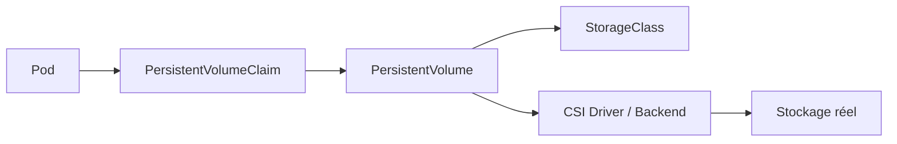

### Couches à comprendre
- **Pod** : consomme le stockage,
- **PVC** : demande de stockage,
- **PV** : ressource de stockage fournie,
- **StorageClass** : politique de provisionnement,
- **CSI** : interface/driver vers le backend réel,
- **backend** : disque cloud, SAN, NAS, Ceph, etc.

---

## 7.2 Pourquoi le stockage est critique
Un cluster Kubernetes peut survivre à la perte d'un Pod.  
Une application stateful ne survit pas forcément à la perte de ses données.

### En production, les vrais sujets sont :
- persistance, performance, cohérence,
- sauvegarde, restauration, reprise après sinistre,
- coûts, latence, multi-zone.

### Angle audit
- les workloads stateful sont-ils clairement identifiés ?
- les données sont-elles considérées comme critiques ?
- les mécanismes de backup sont-ils testés, ou seulement déclarés ?

---

## 7.3 Volumes — principe de base
Un **Volume** est un espace accessible depuis un Pod.

### Ce qu'il faut retenir
- certains volumes sont éphémères (lifecycle = Pod),
- d'autres sont persistants (lifecycle > Pod),
- le bon choix dépend du besoin métier.

---

## 7.4 Types de besoins de stockage

### 1. Temporaire
Fichiers intermédiaires, cache local. Volume éphémère (emptyDir, tmpfs).

### 2. Persistant
Base de données, broker, index, uploads. PVC + PV + StorageClass.

### 3. Partagé
Plusieurs Pods doivent accéder à la même donnée. Mode d'accès RWX requis.

### 4. Configuré à la demande
Provisionnement dynamique selon classe et capacité.

---

## 7.5 PersistentVolume (PV)
Le **PersistentVolume** représente une ressource de stockage dans le cluster.

### Il décrit
- capacité,
- mode(s) d'accès,
- reclaim policy,
- classe de stockage,
- source réelle du backend.

### Cycle de vie d'un PV
- `Available` : libre, prêt à être lié,
- `Bound` : lié à un PVC,
- `Released` : le PVC est supprimé mais le PV n'est pas encore disponible,
- `Failed` : erreur de récupération.

---

## 7.6 PersistentVolumeClaim (PVC)
Le **PersistentVolumeClaim** est la demande de stockage faite par une application.

### Il exprime
- taille demandée,
- mode d'accès,
- StorageClass souhaitée.

### Relation
Le Pod monte le **PVC**, pas directement le PV dans la majorité des cas modernes.

```yaml
apiVersion: v1
kind: PersistentVolumeClaim
metadata:
  name: app-data
spec:
  accessModes:
    - ReadWriteOnce
  storageClassName: fast-ssd
  resources:
    requests:
      storage: 10Gi
```

---

## 7.7 Liaison PVC ↔ PV

### Deux scénarios
1. **statique** : un PV existe déjà et correspond à la demande,
2. **dynamique** : le PVC déclenche la création d'un PV via la StorageClass.

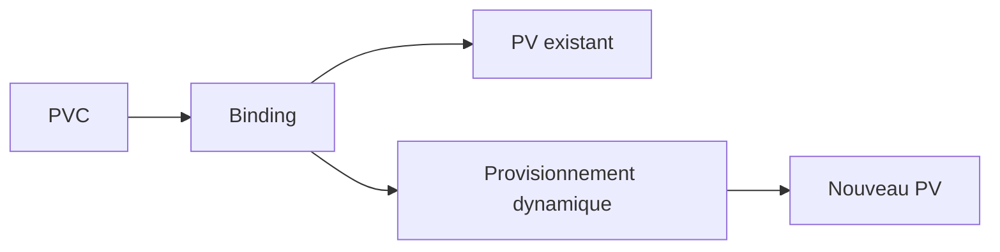

### Symptômes d'échec (PVC Pending)
- aucune classe de stockage valide,
- mode d'accès incompatible,
- capacité introuvable,
- driver CSI cassé ou absent,
- topologie incompatible.

---

## 7.8 Modes d'accès

- **ReadWriteOnce (RWO)** : un seul nœud peut monter en lecture/écriture,
- **ReadOnlyMany (ROX)** : plusieurs nœuds peuvent monter en lecture seule,
- **ReadWriteMany (RWX)** : plusieurs nœuds peuvent monter en lecture/écriture,
- **ReadWriteOncePod (RWOP)** : un seul Pod peut monter le volume.

### Point très important
Beaucoup d'architectures échouent car les équipes confondent :
- "plusieurs réplicas applicatifs"
- et "mode d'accès réellement supporté par le backend".

RWX n'est pas supporté par tous les backends. Les disques blocs cloud (EBS, Azure Disk) sont généralement RWO uniquement.

---

## 7.9 StorageClass
La **StorageClass** décrit comment le stockage est provisionné.

### Elle peut définir
- le provisioner / CSI driver,
- les paramètres backend (type de disque, IOPS, réplication...),
- la reclaim policy,
- le mode de binding,
- l'expansion du volume.

### Exemples
```yaml
apiVersion: storage.k8s.io/v1
kind: StorageClass
metadata:
  name: fast-ssd
provisioner: ebs.csi.aws.com
parameters:
  type: gp3
  iops: "3000"
  throughput: "125"
reclaimPolicy: Delete
allowVolumeExpansion: true
volumeBindingMode: WaitForFirstConsumer
```

---

## 7.10 Provisionnement dynamique

### Avantages
- rapidité, standardisation, autonomie des équipes.

### Risques
- explosion des volumes,
- coûts non maîtrisés,
- classes mal choisies,
- absence de gouvernance lifecycle.

---

## 7.11 reclaimPolicy

- **Delete** : le volume est supprimé quand le PVC est supprimé,
- **Retain** : le volume est conservé (opération manuelle requise ensuite).

### Impact métier
- Environnement de test : `Delete` acceptable,
- Base de données critique : `Retain` recommandé.

---

## 7.12 volumeBindingMode

- `Immediate` : le PV est créé dès que le PVC est créé,
- `WaitForFirstConsumer` : le PV est créé quand le Pod qui utilise le PVC est schedulé.

### Pourquoi WaitForFirstConsumer est important
En multi-zone, cela évite de créer un volume dans une zone incompatible avec le futur placement du Pod.

---

## 7.13 CSI — rôle fondamental
Le **CSI (Container Storage Interface)** standardise l'intégration du stockage dans Kubernetes.

### Ce qu'il apporte
- provisionnement, attachement/détachement, montage,
- snapshots, expansion,
- santé des volumes.

### Idée clé
Le CSI remplace les intégrations in-tree spécifiques et rend Kubernetes plus modulaire.

---

## 7.14 Ce que fait réellement un driver CSI

### Composants fréquents
- **controller plugin** : provisionne, attache, snapshotte (tourne en Deployment),
- **node plugin** : monte le volume dans le Pod (tourne en DaemonSet),
- **sidecars** : external-provisioner, external-attacher, external-snapshotter...

### Angle audit
- driver CSI identifié et à jour ?
- HA du contrôleur ?
- incidents connus avec ce driver ?

---

## 7.15 Backend réel de stockage
Le backend peut être :
- disque cloud (EBS, Azure Disk, GCE PD),
- NFS ou partage de fichiers,
- SAN / NAS,
- Ceph / Rook,
- NetApp, Pure Storage...

### Vision architecte
Le stockage Kubernetes n'est jamais "abstrait" dans la vraie vie.  
Il faut connaître le backend réel et ses limites.

---

## 7.16 Latence, IOPS, throughput

### Il faut arbitrer
- latence, IOPS, débit, coûts, durabilité, disponibilité par zone, snapshots, expansion.

### Anti-pattern courant
Mettre une base très exigeante sur une classe de stockage standard lente puis blâmer Kubernetes.

---

## 7.17 StatefulSet et stockage

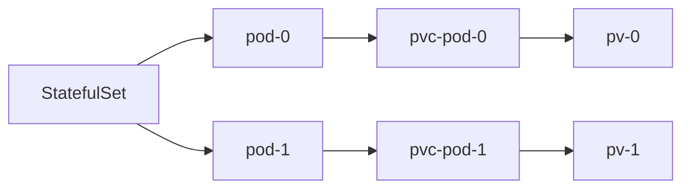

### Ce que StatefulSet ne règle PAS
- la réplication métier des données,
- le quorum applicatif,
- la cohérence applicative,
- la restauration.

---

## 7.18 Headless Service et Stateful workloads

Les applications stateful utilisent souvent un headless service pour :
- découvrir chaque membre par DNS stable,
- parler à des pairs précis.

### Cas typiques
Cassandra, Kafka, ZooKeeper, PostgreSQL HA, Elasticsearch.

---

## 7.19 Volumes partagés et RWX

### Attention
RWX ne doit pas être utilisé "par confort" sans comprendre :
- cohérence, verrouillage, performance, contention.

### Backends supportant RWX
- NFS, CephFS, Azure File, AWS EFS...

---

## 7.20 Ephemeral Volumes
Les volumes éphémères servent aux données temporaires du Pod.

### Bon usage
- cache, build temporaire, transformation locale.

### Mauvais usage
- base de données, données métier durables, état non reconstructible.

---

## 7.21 emptyDir

```yaml
volumes:
  - name: cache
    emptyDir:
      medium: Memory    # tmpfs en RAM (optionnel, plus rapide)
      sizeLimit: 500Mi
```

### Fonctionnement
- créé quand le Pod démarre,
- supprimé quand le Pod disparaît,
- partageable entre les conteneurs d'un même Pod.

### Risque
Remplissage disque (ou RAM si medium: Memory) du nœud si non borné.

---

## 7.22 Projected Volumes
Permettent de projeter plusieurs sources dans un seul point de montage :
- Secrets,
- ConfigMaps,
- Downward API,
- ServiceAccount tokens.

```yaml
volumes:
  - name: all-in-one
    projected:
      sources:
        - secret:
            name: db-secret
        - configMap:
            name: app-config
        - downwardAPI:
            items:
              - path: "labels"
                fieldRef:
                  fieldPath: metadata.labels
```

---

## 7.23 Volume Snapshots

### Cas d'usage
- sauvegarde, restauration, clonage, reprise rapide, workflows de test.

### Très important
Un snapshot de volume n'est pas toujours une **sauvegarde applicative cohérente**.

Pour une base, il faut parfois : quiesce, flush, coordination applicative avant le snapshot.

```yaml
apiVersion: snapshot.storage.k8s.io/v1
kind: VolumeSnapshot
metadata:
  name: app-snapshot
spec:
  volumeSnapshotClassName: csi-aws-vsc
  source:
    persistentVolumeClaimName: app-data
```

---

## 7.24 VolumeSnapshotClass
Définit la politique de snapshot associée au backend.

### Angle audit
- snapshots supportés par le driver ?
- classe cohérente ?
- rétention définie ?
- tests de restauration effectués ?

---

## 7.25 CSI Volume Cloning
Permet de cloner un volume depuis un autre.

```yaml
spec:
  dataSource:
    name: source-pvc
    kind: PersistentVolumeClaim
    apiGroup: ""
```

### Point d'attention
Le clonage ne remplace pas une stratégie de backup/restore complète.

---

## 7.26 Volume Expansion

```yaml
# Dans le PVC, modifier storage:
spec:
  resources:
    requests:
      storage: 20Gi  # Était 10Gi
```

### Question clé
L'expansion est-elle supportée par le driver et la StorageClass (`allowVolumeExpansion: true`) ? En ligne ou hors ligne ?

---

## 7.27 Volume Health Monitoring
Certains drivers exposent l'état de santé des volumes.

### Intérêt
- détection précoce d'erreur,
- corrélation incident stockage ↔ application.

---

## 7.28 Storage Capacity
Kubernetes peut exposer des informations de capacité utiles pour le scheduling selon l'intégration CSI.

### Intérêt
Mieux éviter les placements impossibles quand la capacité disponible est insuffisante dans une zone.

---

## 7.29 Node-specific Volume Limits
Un nœud peut avoir une limite sur le nombre de volumes attachables (ex: AWS EBS limité par type d'instance).

### Symptôme
Pod en Pending avec l'erreur : `node has reached the maximum number of attached volumes`.

---

## 7.30 Local Ephemeral Storage

### Sources de consommation locale
- logs conteneurs,
- images de conteneurs,
- couches de conteneurs,
- emptyDir,
- fichiers temporaires applicatifs.

### Symptômes
- évictions de Pods,
- nœuds en pression disque (`DiskPressure`),
- Pods tués.

```bash
kubectl describe node <node> | grep -A5 "Conditions:"
```

---

## 7.31 Multi-zone et stockage

### Questions critiques
- le volume est-il zonal ou multi-zone ?
- le Pod peut-il être replanifié ailleurs si la zone tombe ?
- quelle latence si le stockage est distant ?

### Point critique
Un mauvais couplage scheduling ↔ stockage provoque des Pods Pending ou des indisponibilités après incident.

---

## 7.32 Backup vs Snapshot vs Restore

| Concept  | Définition |
|----------|-----------|
| Snapshot | Photo rapide du volume à un instant T |
| Backup   | Copie durable avec rétention et stratégie |
| Restore  | Capacité réelle à remettre le service en état |

### Très important
Beaucoup d'équipes ont des snapshots, mais **pas de restauration testée**.

---

## 7.33 Stratégie de sauvegarde
Une vraie stratégie doit répondre à :
- quoi sauvegarder ?
- à quelle fréquence ?
- avec quelle rétention ?
- avec quel RPO / RTO ?
- dans quelle autre zone / région ?

---

## 7.34 Symptômes stockage classiques

**PVC en Pending** : pas de StorageClass valide, CSI absent ou cassé, capacité insuffisante, mode d'accès incompatible.

**Pod Pending avec volume** : volume impossible à attacher, zone incompatible, limite d'attachement atteinte.

**Application lente** : classe de stockage inadaptée, latence backend, contention, backend saturé.

**Perte de données après redéploiement** : usage de volume éphémère à la place d'un PVC, reclaimPolicy `Delete`.

---

## 7.35 Démarche de diagnostic Storage

```bash
# Vue globale
kubectl get pv,pvc,sc
kubectl get volumesnapshot,volumesnapshotclass

# Détail
kubectl describe pvc <pvc>
kubectl describe pv <pv>

# Workload
kubectl get pods -o wide
kubectl describe pod <pod>

# Events
kubectl get events --field-selector=involvedObject.kind=PersistentVolumeClaim

# Driver CSI
kubectl get pods -n kube-system | grep csi
kubectl logs -n kube-system <csi-controller-pod>
```

---

## 7.36 Anti-patterns stockage
- base de données sur `emptyDir`,
- confusion entre snapshot et backup,
- StorageClass par défaut mal gouvernée,
- absence de test de restauration,
- reclaimPolicy `Delete` sur des données critiques,
- RWX utilisé sans compréhension de la cohérence,
- stockage et scheduling pensés séparément.

---

## 7.37 Checklist audit Storage

**Architecture** : workloads stateful identifiés ? StatefulSet utilisé ? headless service présent ?

**Provisionnement** : StorageClasses documentées ? classe par défaut pertinente ? `WaitForFirstConsumer` si multi-zone ?

**Sécurité** : chiffrement backend activé ? volumes orphelins nettoyés ?

**Résilience** : snapshots disponibles ? backups réels ? restauration testée ? PRA documenté ?

**Performance** : classes adaptées aux besoins ? métriques de latence suivies ?

---

## 7.38 Résumé ultra clair
```text
PV          = ressource de stockage
PVC         = demande de stockage
StorageClass = politique de provisionnement
CSI         = interface vers le backend réel
Snapshot    = photo du volume
Backup      = stratégie de protection durable
Restore     = capacité réelle de reprise
emptyDir    = stockage temporaire seulement
```

---

## 7.39 Vision architecte
Un bon design stockage Kubernetes répond à ces questions :
1. Quelle donnée est éphémère et quelle donnée est critique ?
2. Quel backend réel supporte le workload ?
3. Quel mode d'accès faut-il vraiment ?
4. Le scheduling respecte-t-il la topologie stockage ?
5. Que se passe-t-il si le Pod, le nœud ou la zone tombe ?
6. Comment restaure-t-on la donnée ?
7. Quel coût induit chaque classe de stockage ?
8. Quelle preuve a-t-on que la restauration fonctionne ?

---
# 8. Configuration

## 8.1 ConfigMaps
Configuration non sensible : paramètres applicatifs, fichiers de config, variables d'environnement.

### Exemple YAML
```yaml
apiVersion: v1
kind: ConfigMap
metadata:
  name: app-config
data:
  APP_ENV: production
  LOG_LEVEL: info
  config.yaml: |
    server:
      port: 8080
      timeout: 30s
```

### Modes d'utilisation

**Variables d'environnement** :
```yaml
env:
  - name: LOG_LEVEL
    valueFrom:
      configMapKeyRef:
        name: app-config
        key: LOG_LEVEL
envFrom:
  - configMapRef:
      name: app-config
```

**Volume monté** :
```yaml
volumeMounts:
  - name: config-volume
    mountPath: /etc/app
volumes:
  - name: config-volume
    configMap:
      name: app-config
```

### Limite importante
Un ConfigMap est limité à **1 MiB** par objet.

### Mise à jour automatique
Quand un ConfigMap est monté en volume, les fichiers sont mis à jour automatiquement (avec un léger délai). En revanche, les variables d'environnement nécessitent un redémarrage du Pod pour être prises en compte.

### Anti-patterns ConfigMaps
- stocker des données sensibles dans un ConfigMap,
- avoir des dizaines de ConfigMaps sans convention de nommage,
- modifier un ConfigMap en production sans version control.

---

## 8.2 Secrets
Données sensibles : mots de passe, tokens, certificats, clés.

### Types de Secrets
- `Opaque` (défaut) : données arbitraires en base64,
- `kubernetes.io/dockerconfigjson` : credentials de registre d'images,
- `kubernetes.io/tls` : certificat TLS,
- `kubernetes.io/service-account-token` : token ServiceAccount,
- `kubernetes.io/basic-auth`, `kubernetes.io/ssh-auth`.

### Exemple
```yaml
apiVersion: v1
kind: Secret
metadata:
  name: db-credentials
type: Opaque
stringData:           # stringData : en clair, encodé automatiquement
  username: appuser
  password: s3cr3t!
```

### Réalité sur la sécurité des Secrets
Un Secret Kubernetes n'est pas chiffré par défaut dans etcd, seulement encodé en base64.  
Pour une vraie protection : activer **Encryption at Rest** dans l'API Server.

```yaml
# Dans la configuration API Server
--encryption-provider-config=/etc/kubernetes/encryption.yaml
```

### Bonne pratique
Chiffrement au repos + contrôle d'accès RBAC strict + rotation + gestionnaire externe si possible (Vault, AWS Secrets Manager, External Secrets Operator).

### Angle audit configuration
- ConfigMaps et Secrets clairement séparés ?
- probes cohérentes ?
- requests/limits absents ?
- kubeconfigs trop permissifs ?
- conventions de configuration homogènes ?

---

## 8.3 Liveness, Readiness, and Startup Probes
(Voir section 5.7 pour le détail complet)

- **liveness** : redémarrer si cassé,
- **readiness** : retirer du trafic si non prêt,
- **startup** : gérer les démarrages lents.

---

## 8.4 Resource Management for Pods and Containers
(Voir section 5.8 pour le détail complet)

- `requests` : base du scheduling et de la QoS,
- `limits` : plafond de consommation.

### Effets sur scheduling, QoS, évictions
- le scheduler filtre les nœuds sur les `requests`,
- la QoS détermine l'ordre d'éviction,
- les limites mémoire entraînent des OOMKill si dépassées.

---

## 8.5 Organizing Cluster Access Using kubeconfig Files
Gestion de contextes et accès multiples.

### Structure d'un kubeconfig
```yaml
apiVersion: v1
kind: Config
clusters:
  - name: prod-cluster
    cluster:
      server: https://api.prod.example.com
      certificate-authority-data: <base64>
contexts:
  - name: prod-context
    context:
      cluster: prod-cluster
      user: admin
      namespace: default
current-context: prod-context
users:
  - name: admin
    user:
      client-certificate-data: <base64>
      client-key-data: <base64>
```

### Commandes utiles
```bash
kubectl config get-contexts
kubectl config use-context prod-context
kubectl config set-context --current --namespace=app-prod

# Fusionner plusieurs kubeconfigs
KUBECONFIG=~/.kube/config:~/.kube/config-cluster2 kubectl config view --merge --flatten
```

### Bonne pratique
- ne jamais stocker un kubeconfig avec des droits `cluster-admin` dans Git,
- utiliser des tokens à durée de vie limitée,
- préférer OIDC pour les humains.

---

## 8.6 Resource Management for Windows nodes
Particularités d'allocation sur Windows : métriques différentes, limites CPU moins précises, options mémoire distinctes.

---

## 8.7 ConfigMap et Secret — immutabilité

```yaml
metadata:
  name: app-config
immutable: true  # Empêche toute modification, améliore les performances
```

### Intérêt
- protection contre les modifications accidentelles,
- performances kubelet améliorées (pas de watch),
- force l'usage du versioning (nouveau nom pour chaque version).

---

# 9. Security (ULTRA DÉTAILLÉ)

## 9.1 Vision globale de la sécurité Kubernetes
La sécurité Kubernetes est **multi-couches**.

### Couches principales
- identité, authentification, autorisation, admission,
- isolation réseau, isolation runtime,
- protection des secrets, durcissement des nœuds,
- gouvernance et audit.

### Modèle mental simple
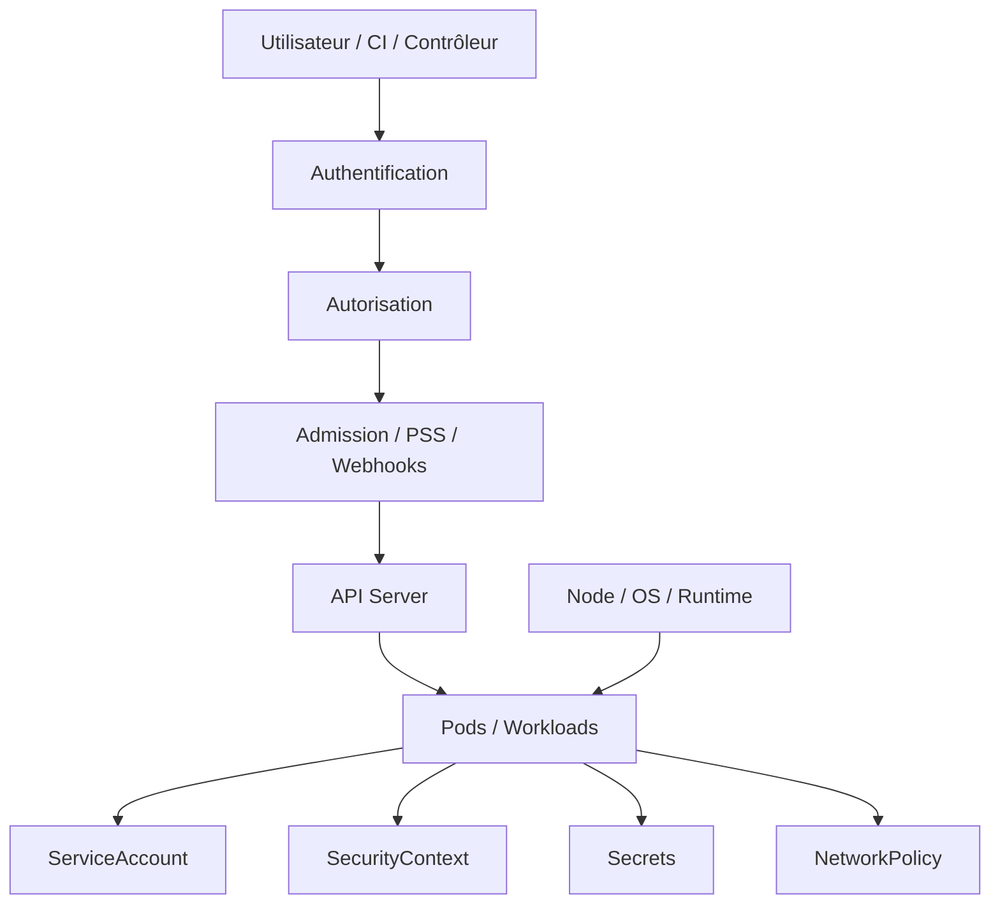

### Idée clé
Sécuriser Kubernetes ne se résume pas à "mettre du RBAC".  
Il faut sécuriser : **qui accède**, **ce qu'il peut faire**, **ce qui peut être déployé**, **comment le conteneur tourne**, **quelles données sensibles il consomme**, **à quoi il peut parler**.

---

## 9.2 Cloud Native Security
La sécurité cloud native s'applique à toutes les couches :
- code, dépendances, images, pipeline CI/CD,
- manifests, cluster, réseau, runtime,
- observabilité, réponse à incident.

### Ce qu'il faut retenir
Kubernetes est un **plan de contrôle**.  
Si le plan de contrôle ou les identités sont faibles, tout le reste devient fragile.

---

## 9.3 Contrôle d'accès à l'API Kubernetes

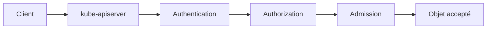

1. **Authentication** : qui es-tu ?
2. **Authorization** : as-tu le droit ?
3. **Admission** : même si tu as le droit, l'objet est-il acceptable ?

---

## 9.4 Authentication

### Mécanismes fréquents
- certificats client (TLS mutuel),
- tokens Bearer (ServiceAccount tokens),
- OIDC (OpenID Connect) — recommandé pour les humains,
- intégrations IAM cloud (IRSA sur AWS, Workload Identity sur GCP...).

### Risques classiques
- comptes partagés (impossible de tracer qui a fait quoi),
- tokens longue durée non rotés,
- cluster-admin attribué trop tôt,
- absence d'identité fédérée claire.

---

## 9.5 Authorization

### Mécanisme principal : RBAC
Un sujet reçoit des permissions via des rôles et des bindings.

### Autres mécanismes
- **ABAC** (Attribute-Based) : déprécié, éviter,
- **Node** : autorisation spécifique pour les kubelets,
- **Webhook** : délègue la décision à un service externe.

---

## 9.6 RBAC — les objets fondamentaux

### Role
Permissions **dans un namespace**.

### ClusterRole
Permissions **à l'échelle cluster** ou réutilisables.

### RoleBinding
Attache un `Role` ou un `ClusterRole` à un sujet dans un namespace.

### ClusterRoleBinding
Attache un `ClusterRole` à un sujet au niveau cluster.

### Schéma
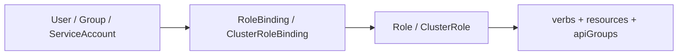

---

## 9.7 RBAC — exemple concret
```yaml
apiVersion: rbac.authorization.k8s.io/v1
kind: Role
metadata:
  name: pod-reader
  namespace: team-a
rules:
  - apiGroups: [""]
    resources: ["pods"]
    verbs: ["get", "list", "watch"]
---
apiVersion: rbac.authorization.k8s.io/v1
kind: RoleBinding
metadata:
  name: read-pods-binding
  namespace: team-a
subjects:
  - kind: ServiceAccount
    name: app-sa
    namespace: team-a
roleRef:
  kind: Role
  name: pod-reader
  apiGroup: rbac.authorization.k8s.io
```

---

## 9.8 RBAC Good Practices

### Bonnes pratiques
- appliquer le **least privilege**,
- éviter `*` sur les verbes et ressources,
- limiter l'usage des `ClusterRoleBinding`,
- séparer les permissions d'administration, lecture et déploiement,
- revoir régulièrement les bindings existants.

### Mauvaises pratiques
- donner `cluster-admin` à tout le monde,
- réutiliser un ServiceAccount unique pour tout,
- oublier les permissions sur les sous-ressources (`pods/log`, `pods/exec`).

---

## 9.9 Vérification pratique RBAC

```bash
kubectl auth can-i get pods -n prod
kubectl auth can-i --list -n prod
kubectl auth can-i create deployments --as=system:serviceaccount:team-a:app-sa -n team-a
```

---

## 9.10 ServiceAccounts

### Idée clé
Quand un Pod parle à l'API Kubernetes, il le fait via un ServiceAccount.

### Bonne pratique
```yaml
spec:
  serviceAccountName: app-sa
  automountServiceAccountToken: false  # Monter seulement si nécessaire
```

### Angle audit
- combien de Pods utilisent le ServiceAccount `default` ?
- quels ServiceAccounts ont des droits élevés ?
- tokens montés inutilement ?

---

## 9.11 ServiceAccount Token — Projected Service Account Token
Depuis Kubernetes 1.20, les tokens projetés remplacent les anciens tokens longue durée.

### Avantages
- durée de vie limitée (1h par défaut),
- liés à un Pod et une audience spécifique,
- rotation automatique.

```yaml
volumes:
  - name: token
    projected:
      sources:
        - serviceAccountToken:
            audience: my-service
            expirationSeconds: 3600
            path: token
```

---

## 9.12 Secrets — rôle
Les **Secrets** servent à stocker des données sensibles :
- mots de passe, tokens, certificats, clés, identifiants d'image.

---

## 9.13 Good practices for Kubernetes Secrets

### Bonnes pratiques
- chiffrer les secrets au repos dans etcd,
- limiter les accès RBAC,
- éviter Git en clair (utiliser Sealed Secrets, SOPS, External Secrets Operator),
- mettre en place la rotation,
- utiliser des gestionnaires externes si nécessaire (HashiCorp Vault, AWS Secrets Manager...).

### Mauvaises pratiques
- secrets en annotations,
- secrets dans ConfigMaps,
- secrets en variables d'environnement visibles dans `kubectl describe`.

---

## 9.14 SecurityContext

```yaml
securityContext:
  runAsNonRoot: true
  runAsUser: 10001
  runAsGroup: 10001
  fsGroup: 10001
  allowPrivilegeEscalation: false
  readOnlyRootFilesystem: true
  seccompProfile:
    type: RuntimeDefault
  capabilities:
    drop:
      - ALL
    add:
      - NET_BIND_SERVICE  # Si besoin de porter < 1024
```

### Champs les plus importants
- `runAsNonRoot` : interdit l'exécution en root,
- `allowPrivilegeEscalation: false` : empêche `sudo`, `setuid`...
- `readOnlyRootFilesystem: true` : filesystem racine en lecture seule,
- `capabilities: drop: [ALL]` : supprime toutes les capacités Linux inutiles,
- `seccompProfile: RuntimeDefault` : profil seccomp par défaut du runtime.

---

## 9.15 Sécurité Linux pour Pods et conteneurs

### Très mauvais signaux en audit
- `privileged: true` sans justification,
- montage de `/var/run/docker.sock`,
- usage large de `hostPath`,
- `hostPID: true` ou `hostNetwork: true`,
- pods root non contrôlés,
- capacités Linux excessives.

---

## 9.16 Pod Security Standards (PSS)

| Niveau | Description |
|--------|-------------|
| **Privileged** | Très permissif, pas de restriction |
| **Baseline** | Réduit les risques grossiers (pas de privileged, pas de hostPath...) |
| **Restricted** | Posture dure : rootless, seccomp, capabilities drop all... |

### Cible recommandée
`Restricted` pour la majorité des namespaces de production.  
`Baseline` comme minimum pour les namespaces système.  
`Privileged` uniquement pour les composants système légitimes.

---

## 9.17 Pod Security Admission (PSA)

```yaml
apiVersion: v1
kind: Namespace
metadata:
  name: app-prod
  labels:
    pod-security.kubernetes.io/enforce: restricted
    pod-security.kubernetes.io/audit: restricted
    pod-security.kubernetes.io/warn: restricted
```

### Modes
- `enforce` : bloque les Pods non conformes,
- `audit` : journalise les violations (sans bloquer),
- `warn` : avertit l'utilisateur (sans bloquer).

### Stratégie progressive
1. commencer par `warn` pour identifier les violations,
2. passer à `audit` pour observer sans bloquer,
3. passer à `enforce` quand les workloads sont conformes.

---

## 9.18 Admission Controllers et Dynamic Admission

### Deux types de webhooks
- **MutatingAdmissionWebhook** : modifie l'objet avant stockage,
- **ValidatingAdmissionWebhook** : accepte ou refuse l'objet.

### Outils fréquents
- **Kyverno** : policies as YAML, facile à prendre en main,
- **OPA Gatekeeper** : policies en Rego, très expressif,
- mécanismes natifs (LimitRanger, ResourceQuota, PSA...).

### Risques webhooks
- indisponibilité du webhook → blocage de tous les déploiements,
- `failurePolicy: Fail` est dangereux sans SLA solide.

---


## 9.18.1 ValidatingAdmissionPolicy et CEL
Les **ValidatingAdmissionPolicies** fournissent une alternative **déclarative** et **in-process** aux validating webhooks pour de nombreux contrôles d'admission.

### Idée clé
Au lieu d'appeler un service externe en webhook, l'API Server peut évaluer directement des règles écrites en **CEL (Common Expression Language)**.

### Pourquoi c'est important
- moins de dépendances réseau,
- moins de risques de panne liés à un webhook indisponible,
- meilleure latence,
- règles versionnables et plus simples pour certains contrôles.

### Quand préférer ValidatingAdmissionPolicy
- règles de validation syntaxiques ou structurelles,
- politiques simples à moyennement complexes,
- contrôles standardisés sur Pods, Deployments, Ingress, Secrets, etc.

### Quand garder les webhooks
- logique très complexe,
- besoin d'appeler des systèmes externes,
- réécriture ou mutation avancée,
- règles impossibles ou peu lisibles en CEL.

### Objets clés
- `ValidatingAdmissionPolicy` : la règle,
- `ValidatingAdmissionPolicyBinding` : le périmètre d'application,
- éventuellement des paramètres associés selon le design retenu.

### Exemple conceptuel
```yaml
apiVersion: admissionregistration.k8s.io/v1
kind: ValidatingAdmissionPolicy
metadata:
  name: require-requests-memory
spec:
  matchConstraints:
    resourceRules:
      - apiGroups: [""]
        apiVersions: ["v1"]
        operations: ["CREATE", "UPDATE"]
        resources: ["pods"]
  validations:
    - expression: "object.spec.containers.all(c, has(c.resources) && has(c.resources.requests) && has(c.resources.requests.memory))"
      message: "Chaque conteneur doit définir requests.memory"
```

### CEL (Common Expression Language)
CEL est un langage d'expressions utilisé dans Kubernetes pour :
- des validations,
- des règles de policy,
- certaines conditions et contraintes API.

### Exemples d'idées de règles CEL
- imposer `runAsNonRoot`,
- refuser `:latest`,
- exiger des `requests`/`limits`,
- interdire certains hostPath,
- forcer une convention de labels.

### Avantages vs webhook
- pas de composant externe à maintenir,
- exécution dans l'API Server,
- moins de timeouts et de points de défaillance.

### Limites
- pas adapté à toute logique métier,
- courbe d'apprentissage CEL,
- lisibilité qui baisse si l'expression devient trop complexe.

### Angle audit
- des webhooks historiques pourraient-ils être remplacés par des policies CEL plus simples ?
- les règles d'admission critiques dépendent-elles d'un composant externe fragile ?
- les bindings couvrent-ils vraiment les namespaces et ressources ciblés ?

## 9.19 Multi-tenancy
Le namespace seul n'est pas une vraie frontière de sécurité forte.

### Multi-tenancy robuste nécessite
- namespaces + RBAC + quotas + LimitRanges + PSS + NetworkPolicies + gouvernance GitOps.

### Approches avancées
- **Virtual Clusters** (vCluster) : cluster Kubernetes dans le cluster,
- **Hierarchical Namespace Controller** (HNC) : hiérarchie de namespaces.

---

## 9.20 Chaîne de compromission typique dans Kubernetes

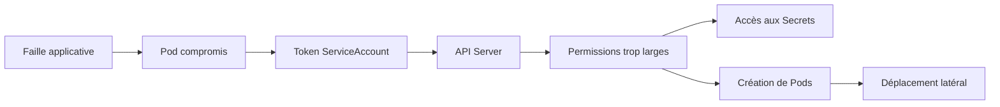

### Idée clé
La vraie sécurité Kubernetes consiste à **casser cette chaîne** à plusieurs niveaux.

---

## 9.21 Hardening Guide — nœuds Linux

### Points clés
- patching OS régulier,
- durcissement système,
- réduction des services inutiles,
- sécurité SSH (désactiver l'accès direct si possible),
- intégrité du runtime,
- séparation admin / exploitation.

---

## 9.22 Audit Logs Kubernetes

```yaml
# Politique d'audit API Server
apiVersion: audit.k8s.io/v1
kind: Policy
rules:
  - level: RequestResponse
    users: []
    resources:
      - group: ""
        resources: ["secrets"]
  - level: Metadata
    omitStages:
      - RequestReceived
```

### Niveaux
- `None` : ne pas journaliser,
- `Metadata` : métadonnées uniquement,
- `Request` : corps de la requête,
- `RequestResponse` : requête et réponse complètes.

### Angle audit
- audit logs activés ?
- stockage des logs sécurisé ?
- rétention définie ?
- alertes sur les actions sensibles ?

---

## 9.23 Exemple YAML — Pod durci
```yaml
apiVersion: v1
kind: Pod
metadata:
  name: hardened-app
spec:
  serviceAccountName: hardened-sa
  automountServiceAccountToken: false
  containers:
    - name: app
      image: mycorp/app:v1.0.0
      securityContext:
        runAsNonRoot: true
        runAsUser: 10001
        allowPrivilegeEscalation: false
        readOnlyRootFilesystem: true
        seccompProfile:
          type: RuntimeDefault
        capabilities:
          drop:
            - ALL
      resources:
        requests:
          cpu: 200m
          memory: 256Mi
        limits:
          cpu: 500m
          memory: 512Mi
```

---

## 9.24 Exemple YAML — ServiceAccount + RBAC minimal
```yaml
apiVersion: v1
kind: ServiceAccount
metadata:
  name: config-reader
  namespace: app-prod
---
apiVersion: rbac.authorization.k8s.io/v1
kind: Role
metadata:
  name: read-configmaps
  namespace: app-prod
rules:
  - apiGroups: [""]
    resources: ["configmaps"]
    verbs: ["get", "list"]
---
apiVersion: rbac.authorization.k8s.io/v1
kind: RoleBinding
metadata:
  name: bind-read-configmaps
  namespace: app-prod
subjects:
  - kind: ServiceAccount
    name: config-reader
    namespace: app-prod
roleRef:
  apiGroup: rbac.authorization.k8s.io
  kind: Role
  name: read-configmaps
```

---

## 9.25 Démarche de diagnostic sécurité

```bash
# RBAC
kubectl auth can-i --list
kubectl get role,rolebinding,clusterrole,clusterrolebinding -A

# ServiceAccounts
kubectl get sa -A

# PSS / PSA
kubectl get ns --show-labels

# Pods privileged
kubectl get pods -A -o json | jq '.items[] | select(.spec.containers[].securityContext.privileged==true) | .metadata.name'

# Secrets
kubectl get secrets -A
```

---

## 9.26 Anti-patterns sécurité
- `cluster-admin` trop large,
- tout le monde en ServiceAccount `default`,
- secrets non chiffrés au repos,
- pods root par défaut,
- `privileged: true` non justifié,
- pas de PSS/PSA,
- API accessible depuis Internet sans restriction,
- absence de segmentation réseau,
- admission webhooks non gouvernés.

---

## 9.27 Checklist audit Security

**Accès API** : authentification claire ? API exposée proprement ? audit logs activés ?

**RBAC** : privilège minimal ? cluster-admin restreint ? bindings obsolètes ?

**ServiceAccounts** : default évité ? tokens montés seulement si besoin ? identité par workload critique ?

**Secrets** : chiffrement etcd ? rotation ? secret sprawl limité ?

**Runtime** : runAsNonRoot ? capabilities minimales ? no privileged sauf exception ? readOnlyRootFilesystem ?

**Gouvernance** : PSA/PSS en place ? webhooks gouvernés ? exceptions documentées ?

---

## 9.28 Grille de remédiation priorisée

### Priorité 1 — immédiat
- réduire les `cluster-admin`,
- supprimer les Pods privilégiés non justifiés,
- désactiver le montage automatique de tokens non nécessaires,
- activer ou renforcer PSS/PSA,
- activer le chiffrement des secrets au repos.

### Priorité 2 — court terme
- refondre RBAC par rôle métier,
- introduire des ServiceAccounts dédiés,
- durcir les SecurityContexts,
- segmenter le réseau avec NetworkPolicies,
- gouverner les Secrets.

### Priorité 3 — moyen terme
- intégrer OIDC/IAM proprement,
- mettre en place une politique d'admission outillée (Kyverno/OPA),
- renforcer le hardening des nœuds,
- industrialiser les contrôles dans GitOps / CI.

---

## 9.29 Questions d'architecte sur la sécurité Kubernetes
- Pourquoi `cluster-admin` est-il dangereux ?
- Pourquoi éviter `ServiceAccount default` ?
- Pourquoi un Secret Kubernetes ne suffit-il pas à lui seul ?
- Quelle différence entre RBAC, PSS et NetworkPolicy ?
- Comment réduire le blast radius si un Pod est compromis ?
- Pourquoi les webhooks d'admission peuvent-ils devenir un SPOF ?
- Comment sécuriser l'accès à l'API Kubernetes ?

---

## 9.30 Résumé final sécurité
```text
RBAC          = qui peut faire quoi
ServiceAccount = identité du Pod
Secret         = donnée sensible à protéger
SecurityContext = comment tourne le conteneur
PSS/PSA        = ce qu'on autorise à déployer
Admission      = dernière barrière avant stockage
Hardening      = réduction globale de la surface de risque
Audit Logs     = traçabilité de toutes les actions
```

---
# 10. Policies

## 10.1 LimitRange — définition et rôle
Les **LimitRange** définissent des bornes de ressources par défaut ou min/max par conteneur, Pod ou PVC dans un namespace.

### Intérêt
- empêche les conteneurs sans `requests/limits` de consommer des ressources illimitées,
- définit des valeurs par défaut si les développeurs oublient de les mettre.

### Exemple
```yaml
apiVersion: v1
kind: LimitRange
metadata:
  name: default-limits
  namespace: app-prod
spec:
  limits:
    - type: Container
      default:             # Valeurs par défaut si non définies
        cpu: 200m
        memory: 256Mi
      defaultRequest:      # Requests par défaut si non définies
        cpu: 100m
        memory: 128Mi
      max:                 # Plafond absolu
        cpu: "2"
        memory: 2Gi
      min:                 # Plancher absolu
        cpu: 10m
        memory: 16Mi
    - type: PersistentVolumeClaim
      max:
        storage: 50Gi
      min:
        storage: 1Gi
```

### Interaction avec QoS
Quand un LimitRange définit des defaults, les Pods sans `requests/limits` passent de BestEffort à Burstable automatiquement.

---

## 10.2 ResourceQuota — définition et rôle
Les **ResourceQuota** imposent des plafonds de consommation globaux par namespace.

### Intérêt
- éviter qu'une équipe monopolise les ressources du cluster,
- contrôler les coûts par namespace,
- forcer la discipline de dimensionnement.

### Exemple
```yaml
apiVersion: v1
kind: ResourceQuota
metadata:
  name: app-prod-quota
  namespace: app-prod
spec:
  hard:
    # Ressources compute
    requests.cpu: "10"
    requests.memory: 20Gi
    limits.cpu: "20"
    limits.memory: 40Gi
    # Objets
    pods: "50"
    services: "20"
    persistentvolumeclaims: "20"
    secrets: "50"
    configmaps: "30"
    # Stockage
    requests.storage: 100Gi
```

### Quota et classes QoS
```yaml
spec:
  hard:
    requests.cpu: "4"
  scopeSelector:
    matchExpressions:
      - operator: In
        scopeName: PriorityClass
        values: ["high-priority"]
```

### Comportement
Si le namespace a atteint sa quota d'objets ou de ressources, les nouvelles créations sont refusées avec une erreur `403 Forbidden`.

---

## 10.3 LimitRange vs ResourceQuota

| Objet | Scope | Contrôle |
|-------|-------|----------|
| LimitRange | Par conteneur/Pod/PVC | Min/max/default par ressource individuelle |
| ResourceQuota | Par namespace | Plafond total de consommation du namespace |

**Bonne pratique** : utiliser les deux ensemble. LimitRange garantit que chaque Pod a des limites raisonnables. ResourceQuota garantit que le namespace entier ne consomme pas trop.

---

## 10.4 Process ID Limits And Reservations
Gestion des PID pour éviter l'épuisement (PID exhaustion).

### Pourquoi c'est important
Si un processus fait un fork bomb ou crée un nombre excessif de processus, il peut épuiser les PIDs disponibles sur le nœud, impactant tous les Pods.

### Paramètres kubelet
```
--pod-max-pids=1024      # Limite de PIDs par Pod
--system-reserved=pid=100 # PIDs réservés pour le système
```

---

## 10.5 Node Resource Managers
Famille de mécanismes pour la gestion fine des ressources nœud.

### Composants
- **Topology Manager** : optimise le placement des ressources NUMA,
- **CPU Manager** : permet la réservation exclusive de CPUs pour les Pods Guaranteed,
- **Memory Manager** : gestion NUMA pour la mémoire,
- **Device Manager** : gestion des ressources matérielles (GPU, FPGA, etc.).

### Cas d'usage avancé
Applications HPC, IA/ML, latence ultra-faible nécessitant un alignement NUMA.

---

## 10.6 PodDisruptionBudget (PDB)
(Voir aussi section 5.17)

Les PDB sont également des objets de politique : ils définissent des règles de disponibilité minimale lors des disruptions volontaires.

### Angle audit policies
- namespaces sans quotas (risque noisy neighbor) ?
- absence de LimitRange (Pods sans limites) ?
- réservations système correctes sur les nœuds ?
- PDB manquants sur les apps critiques ?

---

## 10.7 Résumé Policies
```text
LimitRange     = bornes de ressources par conteneur/Pod dans un namespace
ResourceQuota  = plafond global de consommation d'un namespace
PID Limits     = protection contre l'épuisement de PIDs
PDB            = garantie de disponibilité lors des disruptions
```

---

# 11. Scheduling, Preemption and Eviction (DÉTAILLÉ)

## 11.1 Rôle du Scheduler
Le **kube-scheduler** est responsable d'assigner chaque Pod à un Node.

Il ne crée pas les Pods, il ne les exécute pas : **il décide uniquement du placement**.

---

## 11.2 Cycle complet de scheduling

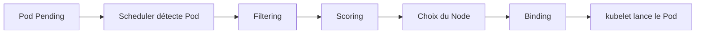

### Étapes détaillées
1. Pod créé sans `nodeName`,
2. Scheduler le récupère depuis la queue,
3. Filtrage des nodes incompatibles,
4. Scoring des nodes restants,
5. Sélection du meilleur node,
6. Binding (écriture de `spec.nodeName`),
7. kubelet sur le node cible démarre le Pod.

---

## 11.3 Phase 1 — Filtering
Le scheduler élimine les nodes non compatibles.

### Critères principaux
- **Ressources** : CPU/mémoire insuffisants au vu des `requests`,
- **nodeSelector** : labels requis absents,
- **nodeAffinity** : contraintes obligatoires non satisfaites,
- **Taints non tolérés** : le nœud repousse le Pod,
- **Volumes** : volume requis non disponible sur le nœud,
- **Ports** : port déjà utilisé sur le nœud,
- **NodeReady** : nœud pas prêt.

### Exemple nodeSelector
```yaml
spec:
  nodeSelector:
    disktype: ssd
    region: eu-west-1
```

---

## 11.4 Phase 2 — Scoring
Les nodes restants sont classés selon plusieurs critères.

### Critères de scoring
- **LeastAllocated** : préfère les nœuds les moins chargés,
- **MostAllocated** : pack les Pods pour libérer des nœuds entiers (utile pour scale-down),
- **NodeAffinity** : bonus si affinity préférée,
- **InterPodAffinity** : rapprocher ou séparer des Pods,
- **ImageLocality** : préfère le nœud ayant déjà l'image.

---

## 11.5 Node Affinity

### Obligatoire (filtre)
```yaml
affinity:
  nodeAffinity:
    requiredDuringSchedulingIgnoredDuringExecution:
      nodeSelectorTerms:
        - matchExpressions:
            - key: kubernetes.io/arch
              operator: In
              values: ["amd64"]
```

### Préférée (scoring)
```yaml
affinity:
  nodeAffinity:
    preferredDuringSchedulingIgnoredDuringExecution:
      - weight: 100
        preference:
          matchExpressions:
            - key: topology.kubernetes.io/zone
              operator: In
              values: ["eu-west-1a"]
```

### IgnoredDuringExecution
Les règles s'appliquent uniquement au scheduling, pas à l'exécution. Un Pod déjà placé ne sera pas évincé si le nœud ne satisfait plus les critères.

---

## 11.6 Pod Affinity / Anti-Affinity

### Pod Anti-Affinity (haute disponibilité)
```yaml
affinity:
  podAntiAffinity:
    requiredDuringSchedulingIgnoredDuringExecution:
      - labelSelector:
          matchLabels:
            app: payments
        topologyKey: kubernetes.io/hostname  # Un seul Pod par nœud
```

### Pod Affinity (co-localisation)
```yaml
affinity:
  podAffinity:
    preferredDuringSchedulingIgnoredDuringExecution:
      - weight: 100
        podAffinityTerm:
          labelSelector:
            matchLabels:
              app: cache
          topologyKey: kubernetes.io/hostname
```

### topologyKey
Définit la granularité : `kubernetes.io/hostname` (nœud), `topology.kubernetes.io/zone` (zone), `topology.kubernetes.io/region` (région).

---

## 11.7 Taints & Tolerations

### Taint (nœud)
```bash
kubectl taint nodes node1 key=value:NoSchedule
kubectl taint nodes node1 key=value:NoExecute
kubectl taint nodes node1 key=value:PreferNoSchedule
```

### Effets
- `NoSchedule` : les Pods sans toleration ne seront pas schedulés,
- `NoExecute` : les Pods sans toleration seront évincés,
- `PreferNoSchedule` : éviter si possible.

### Toleration (Pod)
```yaml
tolerations:
  - key: "node-role.kubernetes.io/control-plane"
    operator: "Exists"
    effect: "NoSchedule"
```

### Cas d'usage typiques
- nœuds dédiés GPU : taint `gpu=true:NoSchedule`,
- nœuds système (control plane),
- nœuds en maintenance,
- nœuds pour workloads critiques uniquement.

---

## 11.8 Topology Spread Constraints
Répartir les Pods sur plusieurs nœuds, zones ou régions.

```yaml
topologySpreadConstraints:
  - maxSkew: 1                              # Déséquilibre max autorisé
    topologyKey: topology.kubernetes.io/zone
    whenUnsatisfiable: DoNotSchedule        # Ou FailSchedule
    labelSelector:
      matchLabels:
        app: payments
```

### Intérêt
Plus souple et plus lisible que l'anti-affinity pour distribuer les Pods sur plusieurs zones.

### maxSkew
Différence maximale entre le nombre de Pods dans les domaines de topologie.  
Exemple : si maxSkew=1, il ne peut pas y avoir plus de 1 Pod de différence entre les zones.

---


## 11.8.1 Pod Scheduling Readiness
Le mécanisme de **Pod Scheduling Readiness** permet de retarder la prise en compte d'un Pod par le scheduler tant que certaines **scheduling gates** n'ont pas été levées.

### Pourquoi c'est utile
Sans ce mécanisme, un Pod créé trop tôt peut rester longtemps en `Pending` et faire travailler inutilement le scheduler et parfois l'autoscaling.

### Cas d'usage
- attendre qu'un ensemble de ressources annexes soit prêt,
- créer un lot de Pods puis déclencher le scheduling au bon moment,
- éviter du churn lorsque des ressources indispensables ne sont pas encore disponibles.

### Principe
Un Pod peut contenir des gates de scheduling. Tant qu'il en reste, le scheduler ne tente pas de placer le Pod.

### Exemple conceptuel
```yaml
apiVersion: v1
kind: Pod
metadata:
  name: batch-worker
spec:
  schedulingGates:
    - name: example.com/wait-for-capacity
  containers:
    - name: worker
      image: busybox
      command: ["sh", "-c", "sleep 3600"]
```

### Levée de la gate
Une fois la condition remplie, un contrôleur ou un processus d'orchestration met à jour le Pod et retire la gate.
Le Pod devient alors éligible au scheduling.

### Angle audit
- certains Pods `Pending` pourraient-ils être mieux gérés via des scheduling gates ?
- le cluster subit-il du churn scheduler/autoscaler à cause de Pods créés trop tôt ?
- l'orchestrateur qui retire la gate est-il fiable et traçable ?

## 11.8.2 Dynamic Resource Allocation (DRA)
La **Dynamic Resource Allocation** est le modèle moderne permettant de demander et d'allouer des ressources complexes, souvent des périphériques matériels comme GPU, FPGA, accélérateurs IA ou autres équipements spécialisés.

### Pourquoi DRA existe
Le modèle historique des **Device Plugins** fonctionne bien pour exposer des ressources simples, mais DRA permet d'aller plus loin :
- meilleure expressivité,
- allocation plus fine,
- partage contrôlé,
- intégration plus riche avec le scheduler,
- cycle de vie plus explicite des demandes de ressources.

### Idée clé
Avec DRA, l'application ne demande pas seulement une quantité abstraite ; elle peut demander une **claim** correspondant à une classe de périphériques ou à des caractéristiques spécifiques.

### Objets principaux DRA
- **DeviceClass** : décrit une classe de périphériques ou de capacités disponibles,
- **ResourceClaim** : demande concrète de ressource pour un workload,
- **ResourceClaimTemplate** : modèle permettant de créer des claims pour un workload,
- **ResourceSlice** : publication de l'inventaire disponible par les drivers DRA.

### 1. DeviceClass
Le `DeviceClass` décrit **ce qui peut être demandé** :
- type de périphérique,
- contraintes,
- paramètres de sélection,
- comportement attendu côté driver.

C'est l'équivalent conceptuel d'une classe d'offre pour des équipements complexes.

### 2. ResourceClaim
Le `ResourceClaim` représente **une demande effective** de ressource.
Un Pod ou un autre workload peut référencer ce claim pour obtenir un périphérique ou une capacité allouée.

### 3. ResourceClaimTemplate
Le `ResourceClaimTemplate` permet de **générer automatiquement** des claims pour les workloads, par exemple pour éviter de créer manuellement un claim par Pod ou par Job.

### 4. ResourceSlice
Le `ResourceSlice` sert à **publier l'inventaire** des ressources gérées par le driver :
- disponibilité,
- caractéristiques,
- découpage logique,
- données exploitables par Kubernetes pour la décision d'allocation.

### DRA vs Device Plugins
**Device Plugins** :
- modèle plus ancien,
- expose des ressources au nœud,
- simple et efficace pour beaucoup de cas.

**DRA** :
- modèle plus riche,
- plus adapté aux cas avancés,
- meilleur contrôle du cycle de demande/allocation,
- meilleure abstraction pour ressources complexes ou partageables.

### Exemple conceptuel côté Pod
```yaml
spec:
  resourceClaims:
    - name: gpu-claim
      resourceClaimTemplateName: ai-gpu-template
  containers:
    - name: trainer
      image: myorg/trainer:1.0
      resources:
        claims:
          - name: gpu-claim
```

### Cas d'usage
- GPU partagés ou spécialisés,
- périphériques IA hétérogènes,
- équipements réseau ou stockage spécialisés,
- scénarios multi-tenant nécessitant une allocation explicite et gouvernée.

### Risques et points d'attention
- RBAC à verrouiller finement,
- dépendance à la qualité des drivers DRA,
- nécessité de bien séparer rôles admin / opérateur / développeur,
- mauvaise compréhension possible du cycle claim/allocation/consommation.

### Angle audit
- le cluster doit-il rester en Device Plugins simples ou passer vers DRA ?
- les accès à `DeviceClass`, `ResourceSlice`, `ResourceClaim` et `ResourceClaimTemplate` sont-ils correctement cloisonnés ?
- les claims orphelins ou inutiles sont-ils nettoyés ?
- l'équipe comprend-elle réellement le modèle DRA ou le subit-elle ?

## 11.8.3 Node Declared Features
Les **Node Declared Features** permettent aux nœuds de déclarer explicitement au control plane certaines capacités ou fonctionnalités supportées, notamment lorsqu'il s'agit de features nouvelles ou feature-gated.

### Pourquoi c'est important
Toutes les capacités d'un nœud ne se résument pas à des labels manuels.
Ce mécanisme fournit une manière plus native et plus fiable d'indiquer quelles fonctionnalités sont réellement supportées.

### Usage général
Ces déclarations peuvent être utilisées par :
- le scheduler,
- des admission controllers,
- des composants tiers,
- des workloads ayant besoin de fonctionnalités précises.

### Bénéfices
- décisions de placement plus sûres,
- validation plus robuste des Pods,
- meilleure prise en compte des différences entre nœuds.

### Différence avec les labels de nœud
- **labels** : souvent administratifs, conventionnels ou ajoutés manuellement,
- **declared features** : plutôt orientées capacités techniques explicitement annoncées par le nœud.

### Cas d'usage typiques
- fonctionnalités récentes disponibles seulement sur certains nœuds,
- environnements mixtes durant une montée de version,
- besoins spécifiques à certains workloads dépendant d'une capacité exacte du nœud.

### Angle audit
- les workloads critiques dépendent-ils de capacités de nœuds seulement documentées “à la main” ?
- faut-il renforcer la fiabilité du placement avec des déclarations natives de capacités ?
- la gouvernance des labels de nœuds masque-t-elle des écarts réels de support ?

## 11.9 Priority & Preemption

### PriorityClass
```yaml
apiVersion: scheduling.k8s.io/v1
kind: PriorityClass
metadata:
  name: high-priority
value: 1000000
globalDefault: false
description: "Workloads critiques de production"
```

```yaml
spec:
  priorityClassName: high-priority
```

### Preemption
Si un Pod haute priorité ne peut pas être schedulé, le scheduler peut évincer des Pods de priorité inférieure pour libérer de la place.

### Priorités système
- `system-cluster-critical` (2000000000) : DNS, etc.,
- `system-node-critical` (2000001000) : kubelet, etc.

### Risque
Une mauvaise configuration des priorités peut entraîner l'éviction répétée de Pods importants.

---

## 11.10 Eviction

### Eviction par kubelet (node pressure)
Déclenchée quand un nœud est en pression :
- **mémoire** : signal `MemoryPressure`,
- **disque** : signal `DiskPressure`.

### Ordre d'éviction (du premier au dernier)
1. Pods BestEffort (aucun requests/limits),
2. Pods Burstable dépassant leurs requests,
3. Pods Guaranteed.

### Seuils d'éviction
```
# kubelet
--eviction-hard=memory.available<100Mi,nodefs.available<10%
--eviction-soft=memory.available<200Mi
--eviction-soft-grace-period=memory.available=1m30s
```

### Diagnostic
```bash
kubectl describe node <node> | grep -A 20 "Conditions:"
kubectl get events --field-selector=reason=Evicted
```

---

## 11.11 Cas réels de scheduling

### HA multi-zone
```yaml
topologySpreadConstraints:
  - maxSkew: 1
    topologyKey: topology.kubernetes.io/zone
    whenUnsatisfiable: DoNotSchedule
    labelSelector:
      matchLabels:
        app: api
```

### Nœuds GPU dédiés
```bash
# Taint nœuds GPU
kubectl taint nodes gpu-node1 nvidia.com/gpu=present:NoSchedule

# Toleration dans le Pod
tolerations:
  - key: nvidia.com/gpu
    operator: Equal
    value: present
    effect: NoSchedule
```

### Séparer prod et dev
```bash
# Dédier des nœuds à la prod
kubectl taint nodes prod-node1 environment=production:NoSchedule
```

---

## 11.12 Diagnostic Scheduler

```bash
# Voir pourquoi un Pod est Pending
kubectl describe pod <pod>
# Chercher "Events" à la fin — le scheduler détaille le motif

# Exemples d'erreurs
# "0/3 nodes are available: insufficient memory"
# "0/3 nodes are available: node(s) had untolerated taint"
# "0/3 nodes are available: pod has unbound immediate PersistentVolumeClaims"

# Voir les logs du scheduler
kubectl logs -n kube-system -l component=kube-scheduler
```

---

## 11.13 Anti-patterns Scheduling
- pas de requests/limits (scheduler aveugle),
- pas d'anti-affinity (tous les Pods sur le même nœud),
- pas de topology spread (zéro résilience multi-zone),
- taints mal compris (trop restrictifs ou trop permissifs),
- PriorityClass mal calibrées (preemption intempestive).

---

## 11.14 Checklist audit Scheduling

- requests/limits présents sur tous les Pods ?
- anti-affinity utilisée pour les apps critiques ?
- topology spread configuré en multi-zone ?
- taints et tolerations cohérents ?
- priority classes définies et documentées ?
- cluster autoscaler compatible avec les contraintes ?

---

## 11.15 Résumé
```text
Scheduler  = placement intelligent des Pods sur les nœuds
Filtering  = élimination des nœuds incompatibles
Scoring    = classement des nœuds compatibles
Affinity   = rapprocher ou contraindre le placement
Taints     = repousser les Pods non tolérés
Preemption = évincer des Pods de faible priorité
Eviction   = retirer des Pods sous pression de ressources
```

---
# 12. Cluster Administration

## 12.1 Node Shutdowns
Gestion de l'arrêt des nœuds.

### Arrêt gracieux d'un nœud
```bash
# Étape 1 : interdire les nouveaux Pods (cordon)
kubectl cordon <node>

# Étape 2 : vider le nœud (drain)
kubectl drain <node> --ignore-daemonsets --delete-emptydir-data --grace-period=60

# Étape 3 : maintenance ou retrait
# ...

# Étape 4 : remettre en service
kubectl uncordon <node>
```

### Graceful Node Shutdown
Depuis Kubernetes 1.21, le kubelet peut gérer un arrêt gracieux du nœud via systemd inhibitor locks.

```yaml
# kubelet configuration
shutdownGracePeriod: 60s
shutdownGracePeriodCriticalPods: 20s
```

---

## 12.2 Swap memory management
Depuis Kubernetes 1.28, le swap est supporté de manière expérimentale.

### Comportement historique
Kubernetes désactivait le swap car il rendait imprévisible la gestion des ressources mémoire.

### Nouveaux modes
- `NoSwap` (défaut) : pas de swap,
- `LimitedSwap` : swap limité selon la configuration.

---

## 12.3 Node Autoscaling
Le **Cluster Autoscaler** ajuste le nombre de nœuds selon la demande.

### Scale-up
Déclenché quand des Pods restent en `Pending` faute de ressources.

### Scale-down
Déclenché quand des nœuds sont sous-utilisés depuis un délai configurable (`--scale-down-delay-after-add`).

### Points d'attention
- les PDB sont respectés pendant le scale-down,
- les nœuds avec des Pods non déplaçables (DaemonSet, `local storage`) ne sont pas drainés,
- le Cluster Autoscaler doit être configuré pour correspondre à l'infrastructure cloud.

### Alternatives modernes
- **Karpenter** (AWS) : provisionnement de nœuds plus rapide et plus intelligent,
- Scaleway Kapsule autoscaling, GKE autopilot...

---

## 12.4 Certificates
Gestion des certificats du cluster.

### Certificats du control plane
- etcd : CA etcd, certificats serveur/client etcd,
- kube-apiserver : certificat serveur API, certificat client kubelet,
- kubelet : certificat client vers API Server,
- front-proxy : pour l'agrégation API.

### Rotation des certificats
```bash
# Vérifier les dates d'expiration
kubeadm certs check-expiration

# Renouveler tous les certificats
kubeadm certs renew all
```

### Angle audit
- certificats expirés ou proches de l'expiration ?
- CA gérée correctement ?
- rotation automatique des certificats kubelet activée ?

---

## 12.5 Cluster Networking
Vue d'ensemble réseau cluster — voir chapitre 6 pour le détail.

### Points d'administration
- CIDR Pod planifié (non chevauchant avec autres réseaux),
- CIDR Service planifié,
- DNS cluster configuré,
- CNI mis à jour selon compatibilité.

---

## 12.6 Logging Architecture

### Architecture de collecte
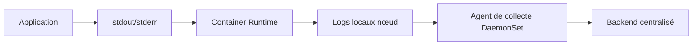

### Patterns de centralisation
- **DaemonSet agent** : Fluentd, Fluent Bit, Promtail — agent sur chaque nœud,
- **Sidecar** : agent de collecte dans chaque Pod (plus de contrôle, plus coûteux),
- **Application directe** : l'app pousse directement vers le backend de logs.

### Bonnes pratiques
- écrire sur `stdout`/`stderr`, pas dans des fichiers (principe cloud-native),
- inclure les métadonnées utiles dans les logs (namespace, pod, service, version),
- définir une rétention cohérente.

---

## 12.7 Observability — Architecture complète

### 3 piliers + traces

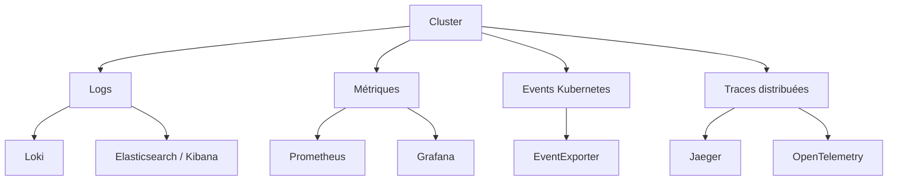

### Logs
```bash
# Logs d'un conteneur
kubectl logs <pod> -c <container>
kubectl logs <pod> -c <container> --previous   # Crash précédent
kubectl logs <pod> -f --tail=100               # Temps réel

# Limites : logs locaux perdus si Pod supprimé → centraliser
```

### Métriques
```bash
kubectl top pod
kubectl top node
```

Stack typique : Prometheus (collecte), Grafana (visualisation), AlertManager (alertes).

### Events Kubernetes
```bash
kubectl get events -n <ns> --sort-by='.lastTimestamp'
kubectl get events -A | grep -i warning
```

### Tracing
- OpenTelemetry (standard), Jaeger, Zipkin,
- nécessite instrumentation applicative.

---

## 12.8 Metrics For Kubernetes System Components

### Composants exposant des métriques
- kube-apiserver : `/metrics`,
- kube-scheduler : `/metrics`,
- kube-controller-manager : `/metrics`,
- kubelet : `/metrics`, `/metrics/cadvisor`,
- etcd : `/metrics`.

### Métriques importantes à surveiller
- `apiserver_request_duration_seconds` — latence API,
- `etcd_disk_wal_fsync_duration_seconds` — performance etcd,
- `kube_pod_status_phase` — états des Pods (via kube-state-metrics),
- `node_memory_MemAvailable_bytes` — mémoire disponible nœud.

### kube-state-metrics
Expose des métriques sur l'état des objets Kubernetes (pas les métriques des conteneurs mais des ressources Kubernetes : Deployments, Pods, Jobs...).

---

## 12.9 System Logs

### Journaux système
```bash
# Logs kubelet
journalctl -u kubelet -f

# Logs du runtime (containerd)
journalctl -u containerd -f

# Logs API Server (si non géré par systemd)
kubectl logs -n kube-system <api-server-pod>
```

---

## 12.10 Compatibility Version For Kubernetes Control Plane Components

### Matrice de compatibilité (version skew)
- kube-apiserver : version N,
- kube-controller-manager, kube-scheduler : N ou N-1,
- kubelet : N-2 à N,
- kubectl : N-1 à N+1.

### Pendant un upgrade
1. Upgrader l'API Server en premier,
2. puis controller-manager et scheduler,
3. puis les nœuds worker (kubelet),
4. Toujours upgrader une version mineure à la fois.

---

## 12.11 API Priority and Fairness (APF)
Contrôle de la charge API pour éviter qu'une source de requêtes ne sature l'API Server.

### Objets
- **FlowSchema** : catégorise les requêtes,
- **PriorityLevelConfiguration** : définit les limites par catégorie.

### Intérêt
Pendant un incident ou un spike de requêtes, les requêtes critiques (health checks, kubelet) restent prioritaires.

---

## 12.12 Admission Webhook Good Practices

### Bonnes pratiques
- définir `failurePolicy: Ignore` pour les webhooks non-critiques en production,
- `failurePolicy: Fail` uniquement si le webhook est hautement disponible,
- exclure les namespaces système (`kube-system`, `kube-public`) des webhooks critiques,
- définir des `namespaceSelector` ou `objectSelector` précis,
- monitorer les latences webhook (trop lent = dégradation de l'API),
- tester le comportement en cas d'indisponibilité du webhook.

### Exemple de configuration sûre
```yaml
webhooks:
  - name: validate.example.com
    failurePolicy: Ignore  # Ou Fail si HA garantie
    namespaceSelector:
      matchExpressions:
        - key: kubernetes.io/metadata.name
          operator: NotIn
          values: ["kube-system", "kube-public"]
    timeoutSeconds: 5
```

---

## 12.13 Proxies in Kubernetes
Plusieurs types de proxies coexistent dans Kubernetes.

### Types
- **kubectl proxy** : proxy local vers l'API Server (pour développement),
- **kube-proxy** : proxy réseau de Service sur chaque nœud,
- **API Aggregation Layer** : proxy vers les API extensions,
- **Ingress Controller** : proxy applicatif L7,
- **Service Mesh** : proxy sidecar L7 (Istio, Linkerd...).

---

## 12.14 Installing Addons
Ajout de composants complémentaires.

### Composants essentiels
- **CoreDNS** : DNS cluster (fourni par défaut),
- **Metrics Server** : métriques CPU/mémoire pour HPA et kubectl top,
- **CNI plugin** : réseau Pod.

### Composants fortement recommandés
- **Ingress Controller** : exposition HTTP/HTTPS,
- **cert-manager** : gestion automatique des certificats,
- **cluster-autoscaler** : autoscaling des nœuds,
- **Prometheus + Grafana** : observabilité,
- **kube-state-metrics** : métriques objets Kubernetes.

---

## 12.15 Coordinated Leader Election
Élection coordonnée de leaders pour les composants HA.

### Fonctionnement
Utilise les objets Lease dans `kube-system` pour qu'un seul scheduler et un seul controller-manager soit actif à la fois.

```bash
# Voir les leases actuels
kubectl get lease -n kube-system
```

---

## 12.16 Angle audit Cluster Administration
- observabilité de base présente (métriques, logs centralisés, alertes) ?
- dashboards utiles et maintenus ?
- certificats expirants surveillés ?
- webhooks critiques testés et haute disponibilité vérifiée ?
- compatibilité de versions maîtrisée ?
- runbooks de maintenance documentés ?
- PRA/PCA du cluster défini et testé ?

---

# 13. Windows in Kubernetes

## 13.1 Windows containers in Kubernetes
Support d'exécution Windows dans Kubernetes.

### Différences clés vs Linux
- pas de namespace PID, IPC, User (différentes garanties d'isolation),
- runtime : containerd avec runhcs,
- pas de Linux capabilities, SecurityContext partiel,
- images Windows plus lourdes.

---

## 13.2 Guide for Running Windows Containers in Kubernetes

### Points d'attention
- réseau : CNI compatible Windows (Calico, Flannel HNS...),
- stockage : SMB, NFS Windows-compatible,
- sécurité : différences dans SecurityContext,
- probes : mêmes mécanismes mais comportement OS différent,
- images : doivent correspondre à la version Windows du nœud.

### Angle audit Windows
- limites connues bien identifiées ?
- workloads réellement compatibles ?
- politiques de sécurité adaptées ?
- séparation nœuds Linux/Windows via taints ?

### Taints pour nœuds Windows
```bash
# Taint automatiquement appliqué par Kubernetes
kubernetes.io/os=windows:NoSchedule

# Toleration dans le Pod
tolerations:
  - key: "kubernetes.io/os"
    operator: "Equal"
    value: "windows"
    effect: "NoSchedule"
```

---

# 14. Extending Kubernetes

## 14.1 Compute, Storage, and Networking Extensions
Extensions de la plateforme.

### 3 interfaces standards
- **CRI** (Container Runtime Interface) : runtime de conteneurs,
- **CSI** (Container Storage Interface) : backends de stockage,
- **CNI** (Container Network Interface) : plugins réseau.

---

## 14.2 Network Plugins (CNI)
Voir section 6.22 pour le détail.

---

## 14.3 Device Plugins
Exposition de ressources matérielles spécialisées : GPU NVIDIA, FPGA, Smart NICs...

### Fonctionnement
Un Device Plugin s'enregistre auprès du kubelet et expose des ressources custom.

```yaml
resources:
  limits:
    nvidia.com/gpu: "1"
```

---

## 14.4 Extending the Kubernetes API

### Deux approches
1. **CRD (Custom Resource Definition)** : types d'objets custom dans l'API native,
2. **API Aggregation** : API server extension via le mécanisme d'agrégation.

---

## 14.5 Custom Resources
Nouveaux types déclaratifs.

### Exemple CRD
```yaml
apiVersion: apiextensions.k8s.io/v1
kind: CustomResourceDefinition
metadata:
  name: databases.mycompany.io
spec:
  group: mycompany.io
  names:
    kind: Database
    plural: databases
  scope: Namespaced
  versions:
    - name: v1
      served: true
      storage: true
      schema:
        openAPIV3Schema:
          type: object
          properties:
            spec:
              type: object
              properties:
                engine:
                  type: string
                  enum: [postgres, mysql]
                replicas:
                  type: integer
```

### Usage après création de la CRD
```yaml
apiVersion: mycompany.io/v1
kind: Database
metadata:
  name: prod-db
spec:
  engine: postgres
  replicas: 3
```

---

## 14.6 Kubernetes API Aggregation Layer
Agrégation d'APIs supplémentaires exposées par des API Servers étendus.

### Exemple
- metrics-server expose l'API `metrics.k8s.io`,
- les requêtes vers cette API sont proxiées par l'API Server principal.

---

## 14.7 Operator pattern
Contrôleurs spécialisés pilotant des applications complexes.

### Principe
Un Operator = CRD + Contrôleur qui comprend les opérations métier de l'application.

```mermaid
flowchart TB
User[Utilisateur / GitOps] --> CR[Custom Resource]
CR --> API[API Server]
API --> OP[Operator / Controller]
OP --> Managed[Application gérée]
Managed --> Status[Status mis à jour]
Status --> API
```

### Niveaux de maturité (OperatorHub)
1. Installation de base,
2. Upgrades,
3. Backup & restore,
4. Full lifecycle,
5. Auto-pilot.

### Exemples d'operators
- Prometheus Operator,
- Strimzi (Kafka),
- CloudNativePG (PostgreSQL),
- cert-manager,
- ArgoCD,
- Vault operator.

### Angle audit extensibilité
- CRDs documentées ?
- operators maîtrisés ou boîtes noires ?
- webhooks associés robustes ?
- dette de dépendance tierce ?
- extensions critiques maintenues et mises à jour ?

---

## 14.8 Client Extensions
Extensions côté client ou outillage autour de l'API.

### Exemples
- plugins `kubectl` via krew,
- SDKs (Go, Python, Java client-go...),
- Helm (templating + gestion de releases),
- Kustomize (overlays sans template).

---

## 14.9 Authentication and Authorization Webhook Extensions
Extensions d'accès API via webhooks.

### TokenReview webhook
Délègue l'authentification à un service externe.

### SubjectAccessReview webhook
Délègue l'autorisation à un service externe (ex: OPA).

---

## 14.10 Dynamic Admission Control
Validation/mutation dynamique des objets via webhooks.

### MutatingWebhookConfiguration
```yaml
apiVersion: admissionregistration.k8s.io/v1
kind: MutatingWebhookConfiguration
metadata:
  name: inject-sidecar
webhooks:
  - name: sidecar.mycompany.io
    clientConfig:
      service:
        name: sidecar-injector
        namespace: istio-system
        path: /inject
    rules:
      - operations: ["CREATE"]
        resources: ["pods"]
    failurePolicy: Ignore
    namespaceSelector:
      matchLabels:
        inject: enabled
```

---

## 14.11 Image Credential Provider Plugins
Plugins de récupération d'identifiants d'images depuis des registres privés.

### Avantages
- credentials dynamiques (ex: tokens ECR AWS rafraîchis automatiquement),
- évite les Secrets `imagePullSecrets` statiques.

---

## 14.12 Scheduling Extensions
Extensions et personnalisation du scheduling.

### Scheduler Framework
Kubernetes 1.22+ : le scheduler est extensible via des plugins.

```
Filter → PreScore → Score → Reserve → Permit → Bind
```

### Cas d'usage
- scheduler custom pour workloads ML (GPU, topologie réseau),
- scheduler multi-cluster,
- scheduling par contraintes métier.

---

# 15. Annexe A — Cartographie audit

## 15.1 Axes d'audit

### Architecture
- control plane HA,
- etcd sauvegardé, isolé, chiffré,
- communication TLS,
- matrice de versions cohérente.

### Workloads
- bon type de contrôleur,
- probes définies,
- ressources définies,
- résilience (PDB, anti-affinity, topology spread).

### Réseau
- CNI identifié et configuré,
- services avec endpoints valides,
- exposition minimisée,
- NetworkPolicies en place.

### Stockage
- workloads stateful identifiés,
- classes de stockage documentées,
- snapshots et backups testés,
- reprise après sinistre documentée.

### Sécurité
- RBAC minimal,
- ServiceAccounts dédiés,
- PSS/PSA actif,
- Secrets chiffrés,
- nœuds durcis.

### Plateforme et exploitation
- observabilité complète,
- certificats surveillés,
- versions maintenues,
- autoscaling cohérent,
- webhooks stables.

---

## 15.2 Questions minimales à poser en mission
1. Quelle est l'architecture de control plane et son niveau de HA ?
2. Quel CNI est utilisé et avec quelles politiques réseau ?
3. Comment sont gérés les Secrets et leur rotation ?
4. Quelles classes de stockage et quelles stratégies de backup ?
5. Comment sont définis requests/limits/quotas ?
6. Quelle gouvernance GitOps ou CI/CD existe ?
7. Comment sont gérées les montées de version ?
8. Quelle observabilité couvre le cluster et les workloads ?
9. Quels webhooks d'admission sont en place et quel est leur SLA ?
10. Comment est géré un incident de sécurité (compromission) ?

---

## 15.3 Grille de maturité rapide

| Domaine | Niveau 0 | Niveau 1 | Niveau 2 | Niveau 3 |
|---------|----------|----------|----------|----------|
| Sécurité | Pas de RBAC | RBAC basique | PSS + SA dédiés | OIDC + admission + hardening |
| Observabilité | Rien | kubectl logs | Prometheus + Grafana | Full stack + traces + alerting |
| Résilience | 1 réplica | Multi-réplicas | PDB + anti-affinity | Multi-zone + PRA testé |
| Stockage | emptyDir | PVC basique | StorageClass + snapshots | Backup testé + RTO/RPO défini |
| Networking | Pas de policy | Services corrects | NetworkPolicy partielle | Default-deny + CNI avancé |

---

# 16. Annexe B — Schémas d'architecture

## 16.1 Architecture cluster complète
```mermaid
flowchart TB
subgraph Users[Utilisateurs et outils]
U1[kubectl]
U2[CI/CD]
U3[GitOps]
end

subgraph CP[Control Plane HA]
LB[API Load Balancer]
API1[API Server 1]
API2[API Server 2]
API3[API Server 3]
ETCD[(etcd cluster)]
SCH[Scheduler]
CM[Controller Manager]
end

subgraph W1[Worker 1]
K1[kubelet]
R1[runtime]
P1[Pods]
end

subgraph W2[Worker 2]
K2[kubelet]
R2[runtime]
P2[Pods]
end

subgraph Platform[Services plateforme]
CNI[CNI]
DNS[CoreDNS]
ING[Ingress / Gateway]
OBS[Observability]
STO[CSI / Storage]
end

U1 --> LB
U2 --> LB
U3 --> LB
LB --> API1
LB --> API2
LB --> API3
API1 --> ETCD
API2 --> ETCD
API3 --> ETCD
API1 --> SCH
API1 --> CM
API1 --> K1
API1 --> K2
K1 --> R1 --> P1
K2 --> R2 --> P2
P1 --- CNI
P2 --- CNI
P1 --- DNS
P2 --- DNS
P1 --- STO
P2 --- STO
ING --> P1
ING --> P2
OBS --> P1
OBS --> P2
```

## 16.2 Chaîne diagnostic rapide
```mermaid
flowchart LR
A[Symptôme] --> B[kubectl get]
B --> C[kubectl describe]
C --> D[kubectl logs]
D --> E[Events]
E --> F[kubectl exec / debug]
F --> G[Cause racine]
G --> H[Remédiation]
```

## 16.3 Flux audit
```mermaid
flowchart TB
I[Inventaire] --> A[Architecture]
A --> N[Network]
N --> S[Security]
S --> W[Workloads]
W --> ST[Storage]
ST --> O[Ops / Observability]
O --> R[Recommandations priorisées]
```

## 16.4 Chaîne de compromission et contre-mesures
```mermaid
flowchart LR
Exploit[Faille app] --> Pod[Pod compromis]
Pod -- "token monté" --> API[API Server]
API -- "RBAC trop large" --> Secrets[Secrets]
API -- "RBAC trop large" --> NewPods[Création Pods]
NewPods --> Lateral[Déplacement latéral]

StopA["automountServiceAccountToken: false"] -.->|coupe| Pod
StopB["RBAC minimal"] -.->|coupe| API
StopC["NetworkPolicy egress"] -.->|coupe| Lateral
```

---

# 17. Synthèse des Concepts (vision architecte)

## 17.1 Carte mentale globale
```mermaid
mindmap
  root((Kubernetes Concepts))
    Architecture
      Control Plane
      Nodes
      Controllers
      etcd
    Workloads
      Pods
      Deployments
      StatefulSets
      DaemonSets
      Jobs / CronJobs
      HPA / VPA
      PDB
    Networking
      Services
      Ingress/Gateway
      NetworkPolicy
      DNS/CoreDNS
      CNI
    Storage
      PV/PVC
      StorageClass
      CSI
      Snapshots
      Backup/Restore
    Configuration
      ConfigMap
      Secrets
      Probes
      Resources
      kubeconfig
    Security
      RBAC
      PSS/PSA
      ServiceAccounts
      SecurityContext
      Secrets chiffrés
      Audit Logs
    Scheduling
      Affinity/AntiAffinity
      Taints/Tolerations
      TopologySpread
      Preemption
      Eviction
    Policies
      Quotas
      LimitRanges
      PID Limits
    Administration
      Observabilité
      Certificats
      Autoscaling
      Upgrades
      Webhooks
    Extensibility
      CRD
      Operators
      Webhooks
      Device Plugins
```

## 17.2 Liens clés entre concepts
- **Pod + Service + DNS** → communication applicative stable,
- **Deployment + ReplicaSet + Controller** → self-healing et rolling update,
- **PV/PVC + StatefulSet + Headless Service** → persistance et identité stable,
- **RBAC + ServiceAccount + API + Audit** → sécurité d'accès et traçabilité,
- **Scheduler + Affinity + Resources + Taints** → placement optimisé,
- **NetworkPolicy + CNI** → segmentation réseau,
- **LimitRange + ResourceQuota** → gouvernance des ressources,
- **HPA + PDB + AntiAffinity** → résilience et scalabilité,
- **CRD + Operator + Webhook** → extensibilité de la plateforme.

## 17.3 Anti-patterns globaux à éviter
- déployer en namespace `default`,
- utiliser `latest` comme tag d'image,
- pas de `requests/limits` sur les conteneurs,
- absence de probes liveness et readiness,
- pas de NetworkPolicy (réseau complètement ouvert),
- RBAC trop permissif (cluster-admin à tout le monde),
- stockage non sauvegardé,
- pas de PDB sur les apps critiques,
- tokens ServiceAccount montés inutilement,
- secrets non chiffrés au repos.

## 17.4 Décisions d'architecture classiques

### Stateless vs Stateful
```
Stateless → Deployment
Stateful + identité + stockage stable → StatefulSet
```

### Exposition
```
HTTP/HTTPS external → Ingress ou Gateway API
TCP/UDP external → Service LoadBalancer
Interne → Service ClusterIP
```

### Stockage
```
Données critiques → PVC + reclaimPolicy Retain + backup
Données temporaires → emptyDir
Données partagées multi-pods → PVC RWX (si supporté)
```

### Sécurité par défaut
```
New namespace → ResourceQuota + LimitRange + PSA restrict + NetworkPolicy default-deny
New workload → SA dédié + automountToken: false + securityContext durci
```

## 17.5 Check rapide (auto-évaluation)
Tu maîtrises les concepts si tu peux :
- expliquer un Deployment sans documentation,
- diagnostiquer un Pod en échec (crash, Pending, OOMKilled),
- expliquer le chemin réseau complet d'une requête HTTP externe,
- expliquer comment un Pod est schedulé sur un nœud,
- expliquer où et comment sont stockées les données persistantes,
- lire un RBAC et dire ce que peut faire un ServiceAccount,
- expliquer ce qu'un webhook d'admission peut bloquer,
- décrire une stratégie de backup et de restore complète.

---

# Conclusion
Ce document constitue une **base complète et structurée des Concepts Kubernetes** à niveau architecte / Expert N3.

Objectif atteint :
- couvrir toute l'arborescence officielle Kubernetes Concepts,
- structurer la compréhension avec exemples, schémas et angles d'audit,
- relier les notions entre elles,
- enrichir les sections initialement trop légères (Policies, Scheduling, Cluster Administration, Extending Kubernetes).

Prochaines étapes (hors de ce document) :
- pratiquer sur un cluster réel,
- Tasks officielle Kubernetes,
- audit d'un cluster de bout en bout,
- provoquer des incidents et les diagnostiquer.

La progression naturelle est :
1. comprendre chaque concept (✓ ce document),
2. pratiquer sur un cluster,
3. provoquer des incidents,
4. diagnostiquer,
5. auditer,
6. recommander une cible.

---
