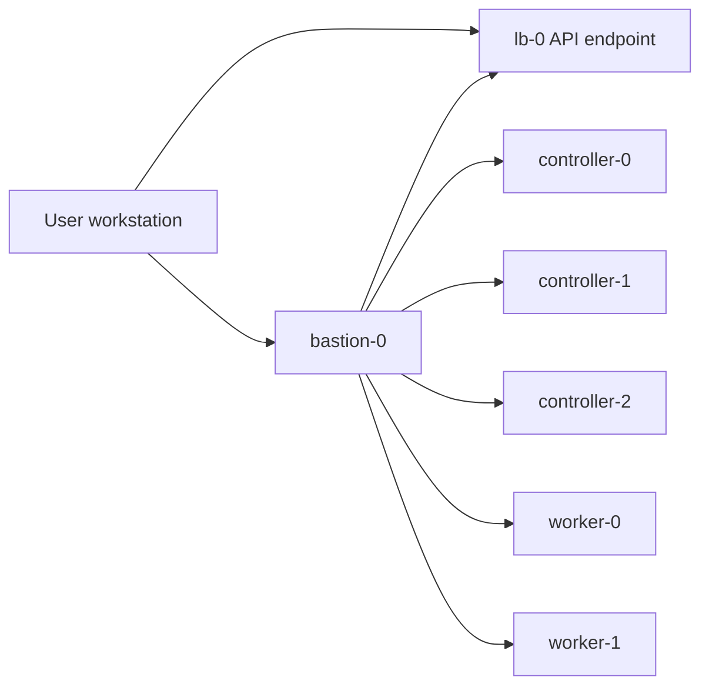

# Access and Security Boundaries

## Purpose

This document explains the access model of the lab once a bastion is introduced.

## Access layers

The topology is now intentionally separated into four layers:

1. **User workstation**
2. **Bastion**
3. **API access layer**
4. **Cluster internal nodes**

## Why a bastion?

A bastion is not required to learn Kubernetes basics, but it becomes valuable when you want to expose:

- a realistic enterprise access model,
- a clear administrative entry point,
- the separation between control traffic and admin traffic,
- access hardening concepts,
- auditability of operator access.

## Separation of concerns

### bastion-0
Administrative access point for SSH and operator actions.

### lb-0
Stable endpoint for the Kubernetes API.

### controllers
Control plane responsibilities only.

### workers
Application execution responsibilities only.

## Design intent

The bastion is added for architecture clarity, not because the load balancer can replace it.

A load balancer and a bastion solve different problems:

- **load balancer**: stable and highly available endpoint
- **bastion**: controlled operator entry point

## Architect questions

- Is administrative access centralized?
- Is API access separated from node access?
- Can operator actions be audited?
- Are private nodes reachable only through a controlled path?
