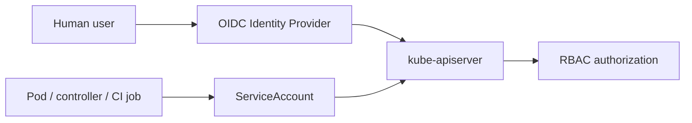

# Identity and Access Federation

## Goal
This document explains how the repository evolves from local certificate-based administration to a more enterprise-ready identity model with human identities, workload identities and external federation.

## Core principle
A mature Kubernetes platform should distinguish clearly between:
- **human identities**: platform engineers, auditors, operators, developers,
- **workload identities**: Pods, controllers, automation jobs, CI/CD pipelines,
- **infrastructure identities**: kubelet, control plane components, node bootstrap actors.

These categories must not share the same trust model or the same permissions.

## Human identities
Human users should ideally authenticate through a centralized Identity Provider (IdP), such as Keycloak, Azure AD, Okta or another OIDC-compatible system.

### Why OIDC matters
OIDC allows the platform to:
- centralize authentication,
- integrate MFA and lifecycle management,
- separate authentication from authorization,
- map external groups to Kubernetes RBAC,
- improve auditability of who did what.

## Workload identities
Workloads should not rely on human kubeconfigs.
They should use dedicated ServiceAccounts with least privilege and explicit token mounting policy.

### Design rule
A workload must never inherit platform-admin level access unless there is an explicit and justified design decision.

## Target model

## Human vs workload separation
A strong platform design enforces:
- no shared kubeconfig between users,
- no reuse of admin identities for automation,
- separate audit paths for users and ServiceAccounts,
- RBAC bindings mapped to role and responsibility.

## Typical enterprise roles
- platform-admin
- cluster-auditor
- namespace-operator
- developer-readonly
- CI-deployer

## Kubernetes side of OIDC
On the API server side, OIDC configuration typically includes:
- issuer URL,
- client ID,
- username claim,
- groups claim,
- CA trust for the issuer if needed.

## Audit questions
- Are human users federated through an IdP?
- Are groups mapped cleanly to RBAC roles?
- Are ServiceAccounts scoped to minimum privilege?
- Is automount of service account tokens controlled?
- Are audit logs capable of distinguishing humans from workloads?

## Anti-patterns
- shared admin kubeconfig across team members,
- CI job using cluster-admin,
- default ServiceAccount used by sensitive workloads,
- no distinction between external groups and Kubernetes role bindings.
